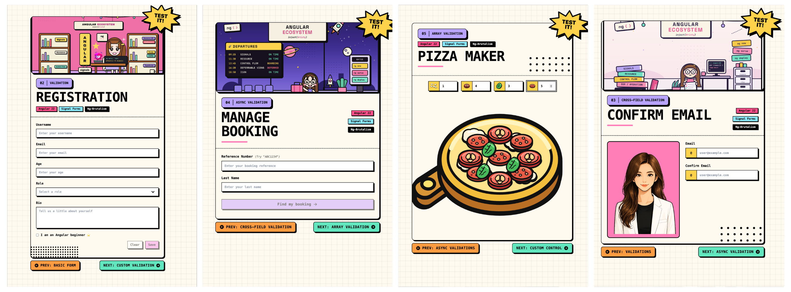

<div align="center">

# 📖 Angular Signal Forms Cookbook

Practical Angular Signal Forms recipes: every flavor of validation, custom `FormValueControl` controls, Zod integration, and form submission. <br/><br/>




</div>


---

## 🧭 Contents

- [Recipes](#-recipes)
- [Getting started](#-getting-started)
- [Scripts](#-scripts)
- [License](#-license)

---

## 🍳 Recipes

Each recipe is a small, runnable example that solves one problem, with a folder-level `README.md` explaining the approach and the gotchas.

| #  | Recipe | What it covers |
|----|--------|----------------|
| 01 | [Basic form](./src/app/recipes/01-basic-form) | `form()`, `Field`, two-way value flow |
| 02 | [Validation basics](./src/app/recipes/02-validation) | Built-in validators, error display, touched/dirty state |
| 03 | [Cross-field validation](./src/app/recipes/03-cross-field) | Validating one field against another |
| 04 | [Async validation](./src/app/recipes/04-async-validation) | Debounced server checks, pending state |
| 05 | [Array validation](./src/app/recipes/05-array-validation) | Per-item rules, add/remove rows, array-level errors |
| 06 | [Conditional validation](./src/app/recipes/06-conditional-validation) | Rules that switch on based on other values |
| 07 | [Custom validation](./src/app/recipes/07-custom-validation) | Writing your own validators, validating a subtree with `validateTree` |
| 08 | [Zod schema validation](./src/app/recipes/08-zod) | Driving form validation from a Zod schema |
| 09 | [Custom control](./src/app/recipes/09-custom-control) | Implementing `FormValueControl` with its own validation |
| 10 | [Form submission](./src/app/recipes/10-submission) | Submit lifecycle via form root, server error mapping |

---

## 🚀 Getting started

```bash
# 1. install
npm install

# 2. run
npm start
```

The app serves at `http://localhost:4200`.

---

## ⚡ Scripts

| Command | What it does |
|---------|--------------|
| `npm start` | Serves the app in development mode with HMR |
| `npm run build` | Production build |
| `npm test` | Runs the full unit test suite |
| `npm run lint` | Lints the workspace |
| `npm run format` | Formats with Prettier |
| `npx nx graph` | Opens the Nx project dependency graph |

---

## 📄 License

[MIT](./LICENSE)
