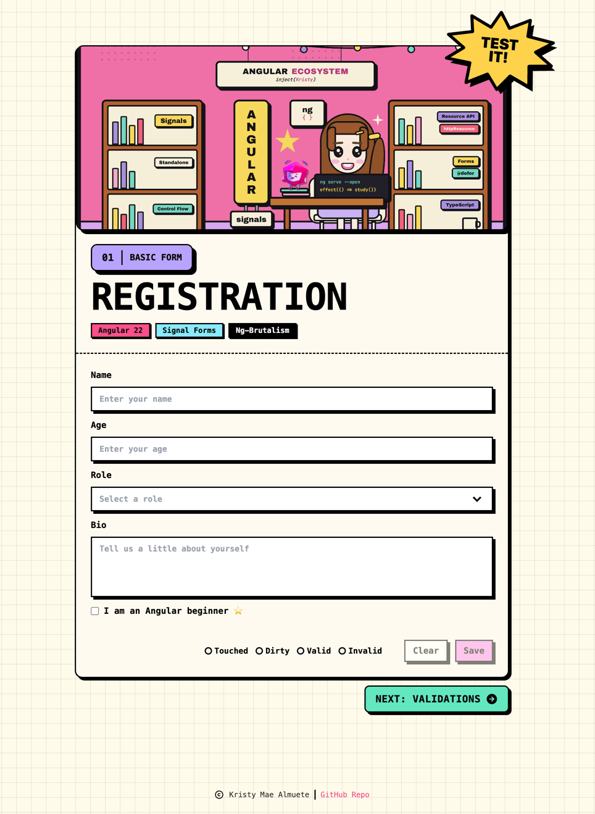

# 01 · Basic Form

> The foundational **Angular Signal Forms** recipe: a neo-brutalist **Registration
> form** that models its data as a `signal`, declares its one rule in a reusable
> `schema()`, assembles the form with `form()`, binds native inputs through
> `[formField]`, reflects live **form state** (touched, dirty, valid, invalid) straight
> from the form's signals, and submits through the Signal Forms **submission API**
> (`[formRoot]` + `submit()`). No `ReactiveFormsModule`, no `FormBuilder`.

<p align="center">
  
</p>

<p align="center">Part of the <a href="../../README.md">Angular Signal Forms Cookbook</a>.</p>

---

## How to run

Run every command from the **repository root**. This is an Nx integrated monorepo, so
all projects share a single root `package.json`.

| Task                              | Command                            |
| --------------------------------- | ---------------------------------- |
| **Serve** (http://localhost:4201) | `pnpm serve:01-basic-form`         |
| Serve (direct)                    | `pnpm exec nx serve 01-basic-form` |
| Build                             | `pnpm exec nx build 01-basic-form` |
| Test                              | `pnpm exec nx test 01-basic-form`  |

---

## Signal Forms API at a glance

| API                                                          | What it does                                                         | Where in this recipe                   |
| ------------------------------------------------------------ | -------------------------------------------------------------------- | -------------------------------------- |
| `signal<T>()`                                                | Holds the form's data model as reactive state                        | `userModel` in `app.ts`                |
| `schema<T>()`                                                | Declares a reusable validation schema, separate from the form        | `registrationSchema` in `app.model.ts` |
| `form(model, schema, options)`                               | Builds a form from the model signal and the schema                   | `userForm = form(userModel, …)`        |
| `required(path.field)`                                       | Built-in validator applied inside the schema                         | `required(path.name)`                  |
| `FormField` / `[formField]`                                  | Directive that binds a native control to a field                     | `[formField]="userForm.name"`          |
| `FormRoot` / `[formRoot]` + `submission.action`              | Wires `<form>` submit: marks all touched, validates, runs the action | opens the summary dialog on submit     |
| `userForm().value()`                                         | Snapshot of the current form value                                   | shown in the submit dialog             |
| `userForm().touched()` · `dirty()` · `valid()` · `invalid()` | Live field-state signals                                             | the status dots + button `disabled`    |
| `userForm().reset(value)`                                    | Resets the form back to an initial value                             | `Clear` and `All Set!`                 |

---

## The form

The Registration form captures five fields. **Name** is the only field validated in
this recipe; validation is expanded in later recipes.

| Field        | Control      | Type                           | Validation     |
| ------------ | ------------ | ------------------------------ | -------------- |
| **Name**     | `nbInput`    | text                           | **`required`** |
| **Age**      | `nbInput`    | number                         | -              |
| **Role**     | `nbSelect`   | `admin` · `moderator` · `user` | -              |
| **Bio**      | `nbTextarea` | multiline text                 | -              |
| **Beginner** | `nbCheckbox` | boolean                        | -              |

---

## Form state

Signal Forms exposes each field's status as a signal that you read directly in the
template. This recipe surfaces them as the live status dots above the form actions:

| State   | Signal                 | True when                              |
| ------- | ---------------------- | -------------------------------------- |
| Touched | `userForm().touched()` | the user has focused and left a field  |
| Dirty   | `userForm().dirty()`   | a value differs from its initial value |
| Valid   | `userForm().valid()`   | every validator passes                 |
| Invalid | `userForm().invalid()` | at least one validator fails           |

`Save` stays disabled until the form is `dirty`, which prevents submitting an untouched
form. And because submission goes through `submit()`, an invalid submit is blocked -
the dialog only opens once the form is valid.

---

## Tech & tools

| Layer     | Tool                                                                | Purpose                                           |
| --------- | ------------------------------------------------------------------- | ------------------------------------------------- |
| Framework | **Angular 22** (standalone, signals, new control flow `@for`/`@if`) | Application shell and reactivity                  |
| Forms     | **`@angular/forms/signals`**                                        | `form()`, `schema()`, `[formField]`, `[formRoot]` |
| UI kit    | **ng-brutalism** (`@ng-brutalism/ui`)                               | `nb-card`, `nbInput`, `nbSelect`, `nbDialog`, …   |
| Icons     | **`@ng-icons/tabler-icons`**                                        | Success and copyright icons                       |
| Styling   | **Tailwind CSS v4** (with the ng-brutalism theme)                   | Utility classes and neo-brutalist tokens          |
| Images    | **`NgOptimizedImage`**                                              | Optimized hero cover (`public/hero-cover.png`)    |
| i18n      | **`@angular/localize`**                                             | Translatable user-facing strings                  |
| Tooling   | **Nx 23** + **esbuild**                                             | Build, serve, and dependency graph                |
| Tests     | **Vitest 4**                                                        | Isolated schema tests + component tests           |

---

## How it works

**1. Model the data and its initial value** (`app.model.ts`)

```ts
export type RegistrationFormModel = {
  name: string;
  age: number | null;
  role: 'admin' | 'moderator' | 'user' | null;
  bio: string;
  beginner: boolean;
};

export const INITIAL_REGISTRATION: RegistrationFormModel = {
  name: '',
  age: null,
  role: null,
  bio: '',
  beginner: false,
};
```

**2. Declare the validation schema, separate from the form** (`app.model.ts`)

Extracting the schema keeps it reusable: the component builds its form from it, and the
tests build the same form in isolation without rendering a component.

```ts
export const registrationSchema = schema<RegistrationFormModel>((path) => {
  required(path.name); // the only validation rule in this recipe
});
```

**3. Build the form and wire submission** (`app.ts`)

```ts
private readonly userModel = signal<RegistrationFormModel>({ ...INITIAL_REGISTRATION });

protected readonly userForm = form(this.userModel, registrationSchema, {
  submission: {
    action: async () => {
      this.dialog().open(); // valid submit opens the summary dialog
    },
  },
});
```

**4. Bind controls and the form root** (`app.html`)

```html
<form [formRoot]="userForm">
  <input nbInput id="name" type="text" [formField]="userForm.name" />
  <nb-select [formField]="userForm.role"> … </nb-select>
  <textarea nbTextarea [formField]="userForm.bio"></textarea>
</form>
```

`[formRoot]` sets `novalidate`, prevents the default submit, and calls `submit()` for
you - which validates first and only runs the action when the form is valid.

**5. Drive the UI from field state** (`app.html`)

```html
<!-- live status dot -->
<span nbStatusDot [state]="userForm().valid() ? 'online' : 'offline'"></span>

<!-- Save is disabled until the user edits the form -->
<button nbButton type="submit" [disabled]="!userForm().dirty()">Save</button>
```

**6. Reset** (`app.ts`)

```ts
protected clear(): void {
  this.dialog().close();
  this.userForm().reset({ ...INITIAL_REGISTRATION });
}
```

On submit, the template opens a dialog that iterates `userForm().value()` with `@for`,
rendering the captured data directly from the form signal.

---

## Testing

Following the [Signal Forms testing guide](https://angular.dev/guide/forms/signals/testing),
tests are split by concern:

- **Isolated schema tests** build the form directly from `registrationSchema`
  (`form(model, registrationSchema, { injector })`) - no component, no DOM - and assert
  `valid()` / `errors()` for the `required` rule. This is the fast default for validation
  logic.
- **Component tests** cover only what the rendered template shows: controls, disabled
  state, values flowing to the model, the submit dialog, and reset.

---

## Internationalization

Every user-facing string is translatable. Template text uses `i18n="@@stableId"` and
TypeScript strings use the `$localize` tagged template. The `@angular/localize/init`
polyfill is wired in `project.json` (build) and `test-setup.ts` (tests). Keep the
`@@` IDs stable; they are the translation contract.
