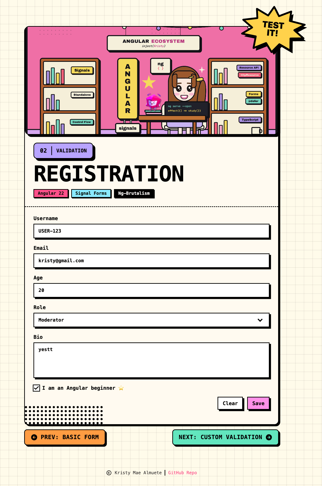

# 02 · Built-in Validations

> The **built-in validators** recipe: the same neo-brutalist **Registration form**,
> now with a validation **schema** that layers `required`, `minLength`, `maxLength`,
> `pattern`, `email`, and `min`. Per-field messages surface through a reusable
> `ValidationErrors` component, and the form submits through the Signal Forms
> **submission API** (`[formRoot]` + `submit()`). No `ReactiveFormsModule`, no
> `FormBuilder`.

<p align="center">
  
</p>

<p align="center">Part of the <a href="../../README.md">Angular Signal Forms Cookbook</a>.</p>

---

## How to run

Run every command from the **repository root**. This is an Nx integrated monorepo, so
all projects share a single root `package.json`.

| Task                              | Command                                      |
| --------------------------------- | -------------------------------------------- |
| **Serve** (http://localhost:4202) | `pnpm serve:02-built-in-validations`         |
| Serve (direct)                    | `pnpm exec nx serve 02-built-in-validations` |
| Build                             | `pnpm exec nx build 02-built-in-validations` |
| Test                              | `pnpm exec nx test 02-built-in-validations`  |

---

## Signal Forms API at a glance

| API                                                | What it does                                                           | Where in this recipe                   |
| -------------------------------------------------- | ---------------------------------------------------------------------- | -------------------------------------- |
| `schema<T>()`                                      | Declares a reusable validation schema, separate from the form          | `registrationSchema` in `app.model.ts` |
| `form(model, schema, options)`                     | Builds a form from the model signal and the schema                     | `userForm = form(userModel, …)`        |
| `required` · `minLength` · `maxLength` · `pattern` | Built-in string validators, each with a custom `message`               | the `username` / `bio` rules           |
| `email`                                            | Built-in email-format validator                                        | the `email` rule                       |
| `min`                                              | Built-in numeric minimum validator                                     | the `age` rule                         |
| `field().errors()`                                 | The active validation errors for a field (each has `kind` + `message`) | `ValidationErrors` component           |
| `FormField` / `[formField]`                        | Binds a native control to a field                                      | `[formField]="userForm.username"`      |
| `FormRoot` / `[formRoot]` + `submission.action`    | Wires `<form>` submit: marks all touched, validates, runs the action   | opens the summary dialog on submit     |
| `userForm().reset(value)`                          | Resets the form back to an initial value                               | `Clear` and `All Set!`                 |

---

## The form

The Registration form captures six fields. Every field except **Beginner** is
validated by one or more **built-in validators**.

| Field        | Control      | Type                           | Validation                                                                |
| ------------ | ------------ | ------------------------------ | ------------------------------------------------------------------------- |
| **Username** | `nbInput`    | text                           | `required` · `minLength(5)` · `maxLength(20)` · `pattern(/^USER-\d{3}$/)` |
| **Email**    | `nbInput`    | email                          | `required` · `email`                                                      |
| **Age**      | `nbInput`    | number                         | `required` · `min(10)`                                                    |
| **Role**     | `nbSelect`   | `admin` · `moderator` · `user` | `required`                                                                |
| **Bio**      | `nbTextarea` | multiline text                 | `required` · `minLength(5)`                                               |
| **Beginner** | `nbCheckbox` | boolean                        | -                                                                         |

### Built-in validators used

| Validator      | Rule                                            |
| -------------- | ----------------------------------------------- |
| `required`     | The value must be present                       |
| `minLength(n)` | At least `n` characters                         |
| `maxLength(n)` | At most `n` characters                          |
| `pattern(re)`  | The value must match the regular expression     |
| `email`        | The value must be a valid email address         |
| `min(n)`       | The number must be greater than or equal to `n` |

Each validator is given a custom `message`, so the UI shows human-readable text
instead of a rule name.

---

## Error display

A small, reusable `ValidationErrors` component renders a field's messages:

| Behaviour         | Detail                                                                      |
| ----------------- | --------------------------------------------------------------------------- |
| **When visible**  | Only once the field is `touched` **or** `dirty` **and** `invalid`           |
| **One error**     | A single line                                                               |
| **Many errors**   | A bulleted list (e.g. `ab` fails both `minLength` and `pattern` at once)    |
| **Accessibility** | `role="alert"` + `aria-live="polite"` so screen readers announce the errors |

---

## Form state

Signal Forms exposes each field's status as a signal you read directly in the template.

| State   | Signal                 | True when                              |
| ------- | ---------------------- | -------------------------------------- |
| Touched | `userForm().touched()` | the user has focused and left a field  |
| Dirty   | `userForm().dirty()`   | a value differs from its initial value |
| Valid   | `userForm().valid()`   | every validator passes                 |
| Invalid | `userForm().invalid()` | at least one validator fails           |

`Save` stays disabled until the form is `dirty` **and** `valid`. And because submission
goes through `submit()`, force-submitting still marks **every** field touched, so all
outstanding errors appear at once.

---

## Tech & tools

| Layer     | Tool                                                                | Purpose                                                 |
| --------- | ------------------------------------------------------------------- | ------------------------------------------------------- |
| Framework | **Angular 22** (standalone, signals, new control flow `@for`/`@if`) | Application shell and reactivity                        |
| Forms     | **`@angular/forms/signals`**                                        | `form()`, `schema()`, built-in validators, `[formRoot]` |
| UI kit    | **ng-brutalism** (`@ng-brutalism/ui`)                               | `nb-card`, `nbInput`, `nbSelect`, `nbDialog`, …         |
| Icons     | **`@ng-icons/tabler-icons`**                                        | Success, copyright, and navigation icons                |
| Styling   | **Tailwind CSS v4** (with the ng-brutalism theme)                   | Utility classes and neo-brutalist tokens                |
| Images    | **`NgOptimizedImage`**                                              | Optimized hero cover (`public/hero-cover.png`)          |
| i18n      | **`@angular/localize`**                                             | Translatable user-facing strings                        |
| Tooling   | **Nx 23** + **esbuild**                                             | Build, serve, and dependency graph                      |
| Tests     | **Vitest 4**                                                        | Isolated schema tests + component tests                 |

---

## How it works

**1. Model the data and its initial value** (`app.model.ts`)

```ts
export type RegistrationFormModel = {
  username: string;
  email: string;
  age: number | null;
  role: 'admin' | 'moderator' | 'user' | null;
  bio: string;
  beginner: boolean;
};

export const INITIAL_REGISTRATION: RegistrationFormModel = {
  username: '',
  email: '',
  age: null,
  role: null,
  bio: '',
  beginner: false,
};
```

**2. Declare the validation schema, separate from the form** (`app.model.ts`)

Extracting the schema keeps it reusable: the component builds its form from it, and the
tests build the same form in isolation without rendering a component.

```ts
export const registrationSchema = schema<RegistrationFormModel>((path) => {
  required(path.username, { message: 'Please enter a username.' });
  minLength(path.username, 5, { message: 'Username must be at least 5 characters long.' });
  maxLength(path.username, 20, { message: 'Username cannot exceed 20 characters.' });
  pattern(path.username, /^USER-\d{3}$/, { message: 'Username must follow the format USER-123.' });

  required(path.email, { message: 'Please enter your email address.' });
  email(path.email, { message: 'Please enter a valid email address.' });

  required(path.age, { message: 'Please enter your age.' });
  min(path.age, 10, { message: 'You must be at least 10 years old.' });

  required(path.role, { message: 'Please select a role.' });

  required(path.bio, { message: 'Please enter a short bio.' });
  minLength(path.bio, 5, { message: 'Bio must be at least 5 characters long.' });
});
```

**3. Build the form and wire submission** (`app.ts`)

```ts
protected readonly userForm = form(this.userModel, registrationSchema, {
  submission: {
    action: async () => {
      this.dialog().open(); // valid submit opens the summary dialog
    },
  },
});
```

**4. Bind controls and the form root** (`app.html`)

```html
<form [formRoot]="userForm">
  <input nbInput id="username" [formField]="userForm.username" />
  <app-validation-errors [field]="userForm.username" />
  …
</form>
```

`[formRoot]` sets `novalidate`, prevents the default submit, and calls `submit()` for
you - which validates first and only runs the action when the form is valid.

**5. Show per-field errors** (`validation-errors.ts` + `.html`)

```html
@if (visible()) {
<ul role="alert" aria-live="polite" [class.list-disc]="hasMultipleErrors()">
  @for (error of errors(); track error.kind) {
  <li>{{ error.message }}</li>
  }
</ul>
}
```

**6. Reset** (`app.ts`)

```ts
protected clear(): void {
  this.dialog().close();
  this.userForm().reset({ ...INITIAL_REGISTRATION });
}
```

---

## Testing

Following the [Signal Forms testing guide](https://angular.dev/guide/forms/signals/testing),
tests are split by concern:

- **Isolated schema tests** build the form directly from `registrationSchema`
  (`form(model, registrationSchema, { injector })`) - no component, no DOM - and assert
  `errors()` / `valid()` for every rule. This is the fast default for validation logic.
- **Component tests** cover only what the rendered template shows: controls, disabled
  state, values flowing to the model, the submit dialog, and touch-driven messages.
- **`ValidationErrors`** is tested against the real registration fields, so its rendering
  is verified against the actual recipe messages.

---

## Internationalization

Every user-facing string is translatable. Template text uses `i18n="@@stableId"` and
TypeScript strings use the `$localize` tagged template. The `@angular/localize/init`
polyfill is wired in `project.json` (build) and `test-setup.ts` (tests). Keep the
`@@` IDs stable; they are the translation contract.
