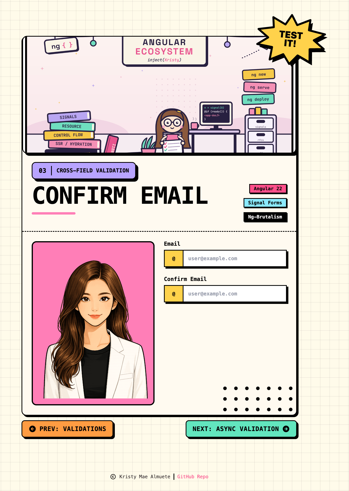

# 03 · Cross-Field Validation

> The **cross-field validation** recipe: a neo-brutalist **Confirm Email** form where
> `confirmEmail` is validated against `email` across the form tree. A single reusable
> `emailSchema` (`required` + `email` + `debounce`) is applied to both fields, then a
> `validate()` rule compares them and raises an `emailMismatch` error when they differ.
> Errors surface live through a `ValidationErrors` component, and a check icon appears
> once both addresses are valid and match. No `ReactiveFormsModule`, no `FormBuilder`.

<p align="center">
  
</p>

<p align="center">
  <a href="https://kshewengger.github.io/angular-signal-forms-cookbook/03-cross-field-validation/"><strong>▶ Live Demo</strong></a>
</p>

<p align="center">Part of the <a href="../../README.md">Angular Signal Forms Cookbook</a>.</p>

---

## How to run

Run every command from the **repository root**. This is an Nx integrated monorepo, so
all projects share a single root `package.json`.

| Task                              | Command                                        |
| --------------------------------- | ---------------------------------------------- |
| **Serve** (http://localhost:4203) | `pnpm serve:03-cross-field-validation`         |
| Serve (direct)                    | `pnpm exec nx serve 03-cross-field-validation` |
| Build                             | `pnpm exec nx build 03-cross-field-validation` |
| Test                              | `pnpm exec nx test 03-cross-field-validation`  |

---

## Signal Forms API at a glance

| API                         | What it does                                                           | Where in this recipe                     |
| --------------------------- | ---------------------------------------------------------------------- | ---------------------------------------- |
| `schema<T>()`               | Builds a reusable `Schema` object for rules shared across paths        | `emailSchema` in `app.schema.ts`         |
| `apply(path, schema)`       | Applies a schema to a field, so one rule set can be reused             | `apply(path.email, emailSchema)`         |
| `validate(path, fn)`        | A custom validator; here it compares one field against another         | the cross-field rule on `confirmEmail`   |
| `valueOf(path)`             | Reads a **sibling** field's value from inside a validator              | `valueOf(path.email)`                    |
| `debounce(path, ms)`        | Delays UI-to-model synchronization (does not affect direct sets)       | `debounce(path, 250)`                    |
| `form(model, schema)`       | Builds a form from the model signal and the schema                     | `userForm = form(userModel, userSchema)` |
| `FormField` / `[formField]` | Binds a native control to a field                                      | `[formField]="userForm.email"`           |
| `field().errors()`          | The active validation errors for a field (each has `kind` + `message`) | `ValidationErrors` component             |
| `userForm().reset(value)`   | Resets the form back to an initial value                               | `clear()`                                |

---

## The form

Two email fields. Both are validated by the same reusable `emailSchema`; **Confirm Email**
is additionally cross-checked against **Email**.

| Field             | Control   | Type  | Validation                                  |
| ----------------- | --------- | ----- | ------------------------------------------- |
| **Email**         | `nbInput` | email | `required` · `email`                        |
| **Confirm Email** | `nbInput` | email | `required` · `email` · **must match Email** |

When the whole form is valid **and** dirty, a green check appears on both inputs.

---

## Cross-field validation

This is the recipe's core idea: a validator on one field that reads **another** field.

```ts
validate(path.confirmEmail, ({ value, valueOf }) => {
  const email = valueOf(path.email); // read the sibling field

  // Only compare once both fields have a value.
  if (!email || !value()) return null;

  // Trim and lower-case both sides before comparing.
  if (email.trim().toLowerCase() !== value().trim().toLowerCase()) {
    return { kind: 'emailMismatch', message: 'Email addresses do not match.' };
  }

  return null;
});
```

| Behaviour            | Detail                                                                  |
| -------------------- | ----------------------------------------------------------------------- |
| **Reads a sibling**  | `valueOf(path.email)` pulls the other field's value into the validator  |
| **Case-insensitive** | `Ada@Dev.io` matches `ada@dev.io`                                       |
| **Whitespace-safe**  | Surrounding spaces are trimmed before comparing                         |
| **Guarded**          | The comparison runs only once **both** fields have a value              |
| **Stacks**           | A malformed `confirmEmail` shows both the format error and the mismatch |

---

## Error display

The same reusable `ValidationErrors` component renders a field's messages:

| Behaviour         | Detail                                                                     |
| ----------------- | -------------------------------------------------------------------------- |
| **When visible**  | Only once the field is `touched` **or** `dirty` **and** `invalid`          |
| **One error**     | A single line                                                              |
| **Many errors**   | A bulleted list (e.g. a bad `confirmEmail` fails **format** and **match**) |
| **Accessibility** | `role="alert"` so screen readers announce the errors                       |

---

## Form state

Signal Forms exposes each field's status as a signal you read directly in the template.

| State   | Signal                 | True when                              |
| ------- | ---------------------- | -------------------------------------- |
| Touched | `userForm().touched()` | the user has focused and left a field  |
| Dirty   | `userForm().dirty()`   | a value differs from its initial value |
| Valid   | `userForm().valid()`   | every validator passes                 |
| Invalid | `userForm().invalid()` | at least one validator fails           |

The success check is driven by a `computed`: `valid = dirty() && valid()`, so it only
appears after the user has edited the form **and** both addresses are valid and match.

---

## Tech & tools

| Layer     | Tool                                                                | Purpose                                                     |
| --------- | ------------------------------------------------------------------- | ----------------------------------------------------------- |
| Framework | **Angular 22** (standalone, signals, new control flow `@for`/`@if`) | Application shell and reactivity                            |
| Forms     | **`@angular/forms/signals`**                                        | `form()`, `schema()`, `apply()`, `validate()`, `debounce()` |
| UI kit    | **ng-brutalism** (`@ng-brutalism/ui`)                               | `nb-card`, `nbInput`, `nb-input-group`, `nbSplit`, …        |
| Icons     | **`@ng-icons/tabler-icons`**                                        | Success, copyright, and navigation icons                    |
| Styling   | **Tailwind CSS v4** (with the ng-brutalism theme)                   | Utility classes and neo-brutalist tokens                    |
| Images    | **`NgOptimizedImage`**                                              | Optimized hero cover (`public/hero-cover.png`)              |
| i18n      | **`@angular/localize`**                                             | Translatable user-facing strings                            |
| Tooling   | **Nx 23** + **esbuild**                                             | Build, serve, and dependency graph                          |
| Tests     | **Vitest 4**                                                        | Isolated schema tests + component tests                     |

---

## How it works

**1. Model the data and its initial value** (`app.model.ts`)

```ts
export type UserFormModel = {
  email: string;
  confirmEmail: string;
};

export const INITIAL_USER: UserFormModel = { email: '', confirmEmail: '' };
```

**2. Declare one reusable email schema** (`app.schema.ts`)

```ts
const emailSchema = schema<string>((path) => {
  required(path, { message: 'Please enter your email.' });
  email(path, { message: 'Please enter a valid email address' });
  debounce(path, 250); // delay UI-to-model sync while typing
});
```

**3. Apply it to both fields, then add the cross-field rule** (`app.schema.ts`)

```ts
export function userSchema(path: SchemaPathTree<UserFormModel>): void {
  apply(path.email, emailSchema);
  apply(path.confirmEmail, emailSchema);

  validate(path.confirmEmail, ({ value, valueOf }) => {
    const email = valueOf(path.email);
    if (!email || !value()) return null;
    return email.trim().toLowerCase() === value().trim().toLowerCase() ? null : { kind: 'emailMismatch', message: 'Email addresses do not match.' };
  });
}
```

**4. Build the form** (`app.ts`)

```ts
private userModel = signal<UserFormModel>({ ...INITIAL_USER });
protected userForm = form(this.userModel, userSchema);
```

**5. Bind controls and show per-field errors** (`app.html`)

```html
<input nbInput id="email" [formField]="userForm.email" />
<app-validation-errors [field]="userForm.email" />

<input nbInput id="confirm-email" [formField]="userForm.confirmEmail" />
<app-validation-errors [field]="userForm.confirmEmail" />
```

**6. Reveal the check when valid** (`app.ts` + `app.html`)

```ts
protected valid = computed(() => this.userForm().dirty() && this.userForm().valid());
```

```html
@if (valid()) {
<ng-icon name="tablerCheck" class="text-green-500!" />
}
```

---

## Testing

Following the [Signal Forms testing guide](https://angular.dev/guide/forms/signals/testing),
tests are split by concern:

- **Isolated schema tests** build the form directly from `userSchema`
  (`form(model, userSchema, { injector })`) - no component, no DOM - and assert the
  cross-field logic: mismatch, exact match, case-insensitive match, whitespace-trimmed
  match, "only compare when both present", and the format + mismatch errors stacking.
  `debounce` only delays typed input, so directly-set values validate synchronously.
- **Component tests** cover what only the template shows: both controls render, an empty
  field's message on touch, the mismatch message under Confirm Email, and the check icon
  appearing on both fields once the form is dirty and valid.
- **`ValidationErrors`** is tested against the real fields, so its rendering is verified
  against the actual recipe messages (including the cross-field mismatch).

---

## Internationalization

Every user-facing string is translatable. Template text uses `i18n="@@stableId"` and
TypeScript strings use the `$localize` tagged template. The `@angular/localize/init`
polyfill is wired in `project.json` (build) and `test-setup.ts` (tests). Keep the
`@@` IDs stable; they are the translation contract.
