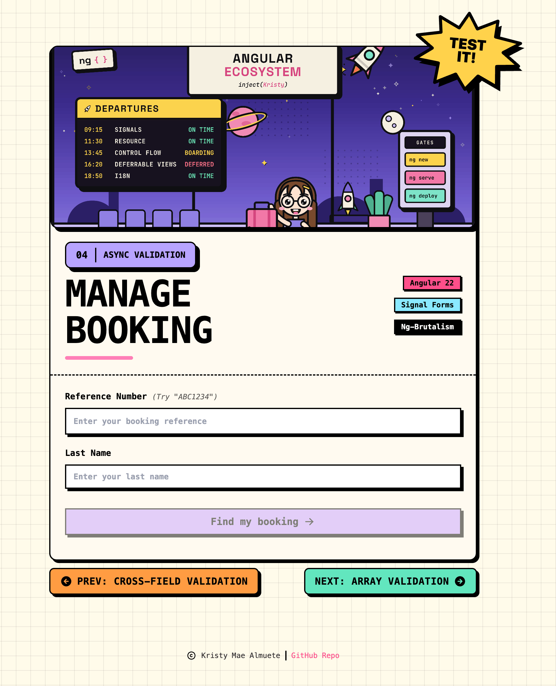

# 04 · Async Validation

> The **async validation** recipe: a neo-brutalist **Manage Booking** form where the
> booking **reference** is verified against a server before the form is allowed through.
> The field is `required`, `debounce`d so it only calls the server once the user pauses
> typing, then checked with **`validateHttp`** - which surfaces a `bookingNotFound`
> error when the reference is unknown and a `networkError` when the request fails. A
> valid reference plus a last name resolves the booking through an `rxResource`, showing
> a live **pending** state along the way. No `ReactiveFormsModule`, no `FormBuilder`.

<p align="center">
  
</p>

<p align="center">Part of the <a href="../../README.md">Angular Signal Forms Cookbook</a>.</p>

---

## How to run

Run every command from the **repository root**. This is an Nx integrated monorepo, so
all projects share a single root `package.json`.

| Task                              | Command                                  |
| --------------------------------- | ---------------------------------------- |
| **Serve** (http://localhost:4204) | `pnpm serve:04-async-validation`         |
| Serve (direct)                    | `pnpm exec nx serve 04-async-validation` |
| Build                             | `pnpm exec nx build 04-async-validation` |
| Test                              | `pnpm exec nx test 04-async-validation`  |

---

## Signal Forms API at a glance

| API                         | What it does                                                                | Where in this recipe                           |
| --------------------------- | --------------------------------------------------------------------------- | ---------------------------------------------- |
| `schema<T>()`               | Declares a reusable validation schema, separate from the form               | `bookingSchema` in `app.model.ts`              |
| `required`                  | Built-in "value must be present" validator                                  | `reference` and `lastName`                     |
| `debounce(path, ms)`        | Delays UI-to-model sync so the server is hit only after a pause             | `debounce(path.reference, 500)`                |
| `validateHttp(path, cfg)`   | **Async, server-backed** validation via `request` / `onSuccess` / `onError` | the `reference` existence check                |
| `form(model, schema)`       | Builds a form from the model signal and the schema                          | `bookingForm = form(userModel, bookingSchema)` |
| `FormField` / `[formField]` | Binds a native control to a field                                           | `[formField]="bookingForm.reference"`          |
| `field().pending()`         | True while an async validator is in flight                                  | drives the in-flight state                     |
| `field().errors()`          | The active validation errors for a field (each has `kind` + `message`)      | `ValidationErrors` component                   |
| `userForm().reset(value)`   | Resets the form back to an initial value                                    | `clear()`                                      |

---

## The form

Two fields. The **reference** is the recipe's focus: it is validated **asynchronously**
against a mock backend. The **last name** is a plain `required` field.

| Field         | Control   | Type | Validation                                               |
| ------------- | --------- | ---- | -------------------------------------------------------- |
| **Reference** | `nbInput` | text | `required` · `debounce(500)` · **`validateHttp` exists** |
| **Last name** | `nbInput` | text | `required`                                               |

Try `ABC1234`, `DEF4567`, or `GHI7890` - those resolve to a booking. Anything else
comes back as **Booking does not exist.**

---

## Async validation

This is the recipe's core idea: a validator that asks the **server** whether a value is
acceptable, instead of deciding locally.

```ts
required(path.reference, { message: 'Please enter your booking reference.' });

// Wait for a typing pause before syncing the model (and hitting the server).
debounce(path.reference, 500);

validateHttp(path.reference, {
  request: ({ value }) => `/api/bookings/${value().trim()}`,

  onSuccess: (response: { exists: boolean }) => (response.exists ? null : { kind: 'bookingNotFound', message: 'Booking does not exist.' }),

  onError: () => ({ kind: 'networkError', message: 'Could not verify the booking.' }),
});
```

| Piece           | Detail                                                                        |
| --------------- | ----------------------------------------------------------------------------- |
| **`request`**   | Builds the URL from the current field value; the trimmed reference is the key |
| **`onSuccess`** | Maps a `200` body to `null` (valid) or a `bookingNotFound` error              |
| **`onError`**   | Maps a failed request to a `networkError` error                               |
| **Debounced**   | The 500 ms `debounce` means keystrokes don't each fire a request              |
| **Pending**     | While the request is in flight the field reports `pending()`                  |

> **Note:** `debounce` only delays UI-driven (typed) updates. Values set directly - as in
> the isolated tests - sync immediately, so validation runs without waiting.

---

## The mock backend

There is no real server. A functional HTTP interceptor answers the `validateHttp`
request in-process (`src/mock.interceptor.ts`), wired in `app.config.ts` via
`provideHttpClient(withInterceptors([mockHttpInterceptor]))`:

```ts
if (req.method === 'GET' && req.url.startsWith('/api/bookings/')) {
  const reference = req.url.split('/').pop() ?? '';
  return of(
    new HttpResponse({
      status: 200,
      body: { exists: ['ABC1234', 'DEF4567', 'GHI7890'].includes(reference.toUpperCase()) },
    }),
  );
}
```

The comparison is case-insensitive, so `abc1234` resolves the same as `ABC1234`.

---

## Resolving the booking

Once the form is valid, submitting sets a `payload` signal that feeds an `rxResource`.
The resource streams a mocked booking (with an artificial delay) and drives three states
the template switches on:

| State        | Signal                      | UI                           |
| ------------ | --------------------------- | ---------------------------- |
| **Loading**  | `bookingResource.isLoading` | a progress bar / "Fetching…" |
| **Resolved** | `status() === 'resolved'`   | the `BookingInfo` panel      |
| **Idle**     | neither                     | the form                     |

```ts
private bookingResource = rxResource({
  params: this.payload,
  stream: ({ params }) => of(generateMockBookingResponse(params)).pipe(delay(1000)),
});
```

---

## Error display

The same reusable `ValidationErrors` component renders a field's messages:

| Behaviour         | Detail                                                            |
| ----------------- | ----------------------------------------------------------------- |
| **When visible**  | Only once the field is `touched` **or** `dirty` **and** `invalid` |
| **One error**     | A single line (this recipe's fields raise one error at a time)    |
| **Accessibility** | `role="alert"` so screen readers announce the errors              |

---

## Form state

Signal Forms exposes each field's status as a signal you read directly in the template.

| State   | Signal                              | True when                              |
| ------- | ----------------------------------- | -------------------------------------- |
| Touched | `bookingForm().touched()`           | the user has focused and left a field  |
| Dirty   | `bookingForm().dirty()`             | a value differs from its initial value |
| Pending | `bookingForm.reference().pending()` | the async check is in flight           |
| Valid   | `bookingForm().valid()`             | every validator passes                 |
| Invalid | `bookingForm().invalid()`           | at least one validator fails           |

Submit stays disabled until the form is `dirty` **and** `valid` - which, for the
reference, means the server has confirmed the booking exists.

---

## Tech & tools

| Layer     | Tool                                                                | Purpose                                                          |
| --------- | ------------------------------------------------------------------- | ---------------------------------------------------------------- |
| Framework | **Angular 22** (standalone, signals, new control flow `@for`/`@if`) | Application shell and reactivity                                 |
| Forms     | **`@angular/forms/signals`**                                        | `form()`, `schema()`, `required`, `debounce()`, `validateHttp()` |
| Async     | **`rxResource`** + **`HttpClient`** interceptor                     | Booking lookup and the mock backend                              |
| UI kit    | **ng-brutalism** (`@ng-brutalism/ui`)                               | `nb-card`, `nbInput`, `nb-progress`, `nbSection`, …              |
| Icons     | **`@ng-icons/tabler-icons`**                                        | Success, flight, and navigation icons                            |
| Styling   | **Tailwind CSS v4** (with the ng-brutalism theme)                   | Utility classes and neo-brutalist tokens                         |
| Images    | **`NgOptimizedImage`**                                              | Optimized hero cover (`public/hero-cover.png`)                   |
| i18n      | **`@angular/localize`**                                             | Translatable user-facing strings                                 |
| Tooling   | **Nx 23** + **esbuild**                                             | Build, serve, and dependency graph                               |
| Tests     | **Vitest 4**                                                        | Isolated schema tests + component tests                          |

---

## How it works

**1. Model the data and its initial value** (`app.model.ts`)

```ts
export type BookingFormModel = {
  reference: string;
  lastName: string;
};

export const INITIAL_BOOKING: BookingFormModel = { reference: '', lastName: '' };
```

**2. Declare the schema, separate from the form** (`app.model.ts`)

Extracting the schema keeps it reusable: the component builds its form from it, and the
tests build the same form in isolation without rendering a component.

```ts
export const bookingSchema = schema<BookingFormModel>((path) => {
  required(path.reference, { message: 'Please enter your booking reference.' });
  debounce(path.reference, 500);
  validateHttp(path.reference, {
    request: ({ value }) => `/api/bookings/${value().trim()}`,
    onSuccess: (r: { exists: boolean }) => (r.exists ? null : { kind: 'bookingNotFound', message: 'Booking does not exist.' }),
    onError: () => ({ kind: 'networkError', message: 'Could not verify the booking.' }),
  });
  required(path.lastName, { message: 'Please enter your last name.' });
});
```

**3. Provide the (mock) HTTP client** (`app.config.ts`)

```ts
provideHttpClient(withInterceptors([mockHttpInterceptor]));
```

**4. Build the form** (`app.ts`)

```ts
private userModel = signal<BookingFormModel>({ ...INITIAL_BOOKING });
protected bookingForm = form(this.userModel, bookingSchema);
```

**5. Bind controls and show per-field errors** (`app.html`)

```html
<input nbInput id="reference" [formField]="bookingForm.reference" /> <app-validation-errors [field]="bookingForm.reference" />
```

**6. Resolve the booking on submit** (`app.ts` + `app.html`)

```ts
private bookingResource = rxResource({
  params: this.payload,
  stream: ({ params }) => of(generateMockBookingResponse(params)).pipe(delay(1000)),
});
```

```html
@if (loading()) {
<!-- progress -->
} @else if (resolved()) { <app-booking-info [booking]="bookingInfo()!" (back)="clear()" /> } @else {
<!-- form -->
}
```

---

## Testing

Following the [Signal Forms testing guide](https://angular.dev/guide/forms/signals/testing),
tests are split by concern:

- **Isolated schema tests** build the form directly from `bookingSchema`
  (`form(model, bookingSchema, { injector })`) - no component, no DOM. They provide the
  mock `HttpClient` and `await ApplicationRef.whenStable()` so the async `validateHttp`
  check resolves, then assert the reference's `required`, `bookingNotFound`, and
  case-insensitive behaviour, plus the last-name `required` rule and the whole-form state.
- A dedicated **network-failure** block swaps in a failing interceptor to prove the
  `onError` → `networkError` branch.
- **Component tests** cover what only the template shows: the controls render, submit is
  disabled while pristine, the required message appears on touch, and the full happy flow
  (valid reference + last name → submit → the resolved `BookingInfo`).
- **`ValidationErrors`** is tested against the real booking fields, so its rendering is
  verified against the actual recipe messages, including the async `bookingNotFound`.

---

## Internationalization

Every user-facing string is translatable. Template text uses `i18n="@@stableId"` and
TypeScript strings use the `$localize` tagged template. The `@angular/localize/init`
polyfill is wired in `project.json` (build) and `test-setup.ts` (tests). Keep the
`@@` IDs stable; they are the translation contract.
