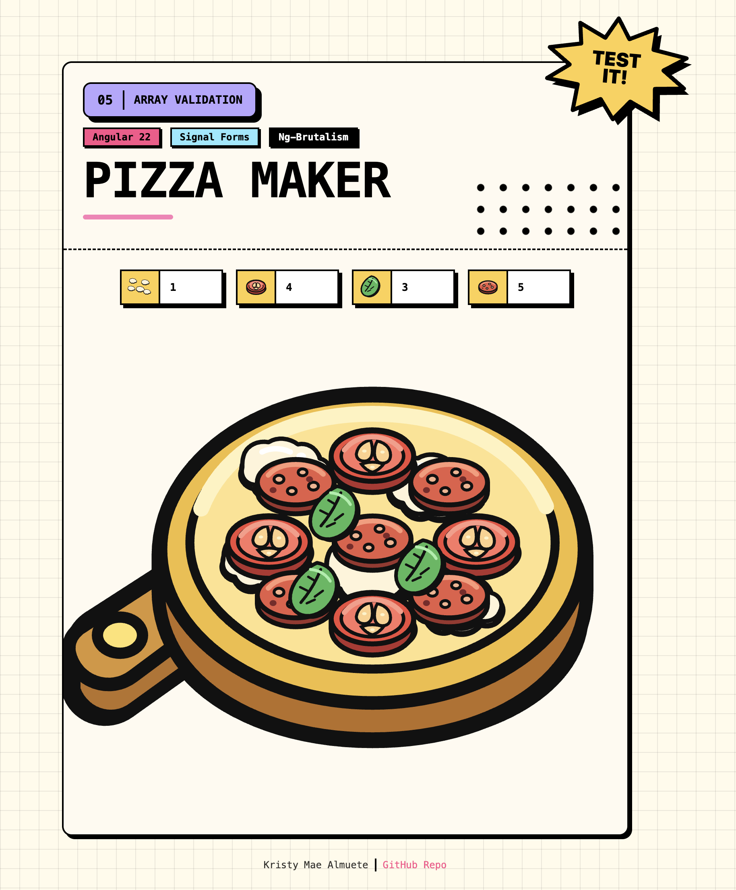

# 05 · Array Validation

> The **array validation** recipe: a neo-brutalist **Pizza Maker** where the form model
> is an **array** of toppings, each `{ id, count }`. A single per-item schema is applied
> to every element with **`applyEach`**, so one rule set validates the whole array. Each
> item enforces `min(0)` ("Count cannot be negative") and a **per-item maximum derived
> from its own `id`** via `valueOf` (a `toppingMax` error like "Max 5"). Errors surface
> per item through a `ValidationErrors` component that reads `errorSummary()`, and the
> toppings pop onto the pizza board as their counts rise. No `ReactiveFormsModule`, no
> `FormBuilder`.

<p align="center">
  
</p>

<p align="center">Part of the <a href="../../README.md">Angular Signal Forms Cookbook</a>.</p>

---

## How to run

Run every command from the **repository root**. This is an Nx integrated monorepo, so
all projects share a single root `package.json`.

| Task                              | Command                                  |
| --------------------------------- | ---------------------------------------- |
| **Serve** (http://localhost:4205) | `pnpm serve:05-array-validation`         |
| Serve (direct)                    | `pnpm exec nx serve 05-array-validation` |
| Build                             | `pnpm exec nx build 05-array-validation` |
| Test                              | `pnpm exec nx test 05-array-validation`  |

---

## Signal Forms API at a glance

| API                           | What it does                                                                 | Where in this recipe                                  |
| ----------------------------- | ---------------------------------------------------------------------------- | ----------------------------------------------------- |
| `applyEach(path, itemSchema)` | Applies a schema to **every element** of an array field                      | `applyEach(path.toppings, pizzaToppingItemSchema)`    |
| `schema<T>()`                 | Declares a reusable validation schema, separate from the form                | `pizzaMakerSchema` in `app.model.ts`                  |
| `min(path, n)`                | Built-in numeric minimum validator                                           | `min(item.count, 0)`                                  |
| `validate(path, fn)`          | Custom validator; here it computes a per-item maximum                        | the `toppingMax` rule                                 |
| `valueOf(path)`               | Reads a **sibling** field's value inside a validator                         | `valueOf(item.id)` to look up the topping             |
| `field().errorSummary()`      | Every error on a field **and its descendants** (each has `kind` + `message`) | `ValidationErrors` reads the item field               |
| `FormField` / `[formField]`   | Binds a native control to a field                                            | `[formField]="pizzaMakerForm.toppings[$index].count"` |
| `form(model, schema)`         | Builds a form from the model signal and the schema                           | `pizzaMakerForm = form(model, pizzaMakerSchema)`      |

---

## The form

The model is an **array**, one entry per topping, and every entry is validated by the
same per-item schema. The maximum is different for each topping and is looked up from the
item's own `id`.

| Topping        | Field     | Type   | Validation                          |
| -------------- | --------- | ------ | ----------------------------------- |
| **Mozzarella** | `nbInput` | number | `min(0)` · max **1** (`toppingMax`) |
| **Tomato**     | `nbInput` | number | `min(0)` · max **4** (`toppingMax`) |
| **Basil**      | `nbInput` | number | `min(0)` · max **3** (`toppingMax`) |
| **Pepperoni**  | `nbInput` | number | `min(0)` · max **5** (`toppingMax`) |

As the counts change, the toppings appear on the pizza board (up to each topping's max).

---

## Array validation

This is the recipe's core idea: validate **each element** of an array with one shared
schema instead of hand-writing a rule per index.

```ts
// The per-item schema, applied to every topping.
export function pizzaToppingItemSchema(item: SchemaPathTree<PizzaFormModelItem>) {
  min(item.count, 0, { message: 'Count cannot be negative' });

  validate(item.count, ({ value, valueOf }) => {
    const toppingId = valueOf(item.id); // read the item's own id
    const maxCount = PIZZA_TOPPINGS_MAP[toppingId]?.max ?? 0;

    return value() > maxCount ? { kind: 'toppingMax', message: `Max ${maxCount}` } : null;
  });
}

// Applied to the whole array with a single call.
export const pizzaMakerSchema = schema<PizzaFormModel>((path) => {
  applyEach(path.toppings, pizzaToppingItemSchema);
});
```

| Piece               | Detail                                                                    |
| ------------------- | ------------------------------------------------------------------------- |
| **`applyEach`**     | Runs `pizzaToppingItemSchema` against every element of `toppings`         |
| **Per-item max**    | `valueOf(item.id)` looks the topping up, so the limit differs per item    |
| **Independent**     | One invalid item does not invalidate the others                           |
| **Reused in tests** | The extracted `pizzaMakerSchema` builds the same form without a component |

---

## The pizza board

A `computed` maps the current model to counts, and the template reveals that many
toppings per id:

```ts
protected visibleCounts = computed(
  () => new Map(this.pizzaMakerModel().toppings.map((t) => [t.id, t.count])),
);
```

```html
 $index" ... />
```

---

## Error display

The reusable `ValidationErrors` component is bound to the **item** field
(`pizzaMakerForm.toppings[$index]`) and reads `errorSummary()`, so it surfaces errors
raised on the item's `count` child.

| Behaviour         | Detail                                                                      |
| ----------------- | --------------------------------------------------------------------------- |
| **When visible**  | Only once the item is `touched` **or** `dirty` **and** `invalid`            |
| **One error**     | A single line (`min` and `toppingMax` are mutually exclusive per item)      |
| **Accessibility** | `role="alert"` + `aria-live="polite"` so screen readers announce the errors |

---

## Form state

Signal Forms exposes each field's status as a signal you read directly in the template.

| State   | Signal                                   | True when                              |
| ------- | ---------------------------------------- | -------------------------------------- |
| Touched | `pizzaMakerForm.toppings[i]().touched()` | the user has focused and left an item  |
| Dirty   | `pizzaMakerForm.toppings[i]().dirty()`   | a value differs from its initial value |
| Valid   | `pizzaMakerForm().valid()`               | every item passes                      |
| Invalid | `pizzaMakerForm().invalid()`             | at least one item fails                |

A parent field aggregates its children, so `pizzaMakerForm().invalid()` is `true` as soon
as any single topping exceeds its max.

---

## Tech & tools

| Layer     | Tool                                                                | Purpose                                                    |
| --------- | ------------------------------------------------------------------- | ---------------------------------------------------------- |
| Framework | **Angular 22** (standalone, signals, new control flow `@for`/`@if`) | Application shell and reactivity                           |
| Forms     | **`@angular/forms/signals`**                                        | `form()`, `schema()`, `applyEach()`, `min()`, `validate()` |
| UI kit    | **ng-brutalism** (`@ng-brutalism/ui`)                               | `nb-card`, `nbInput`, `nb-input-group`, `nbHalftone`, …    |
| Icons     | **`@ng-icons/tabler-icons`**                                        | Copyright and navigation icons                             |
| Styling   | **Tailwind CSS v4** (with the ng-brutalism theme)                   | Utility classes, plus component-scoped topping animations  |
| Images    | **`NgOptimizedImage`**                                              | Optimized topping and board SVGs                           |
| i18n      | **`@angular/localize`**                                             | Translatable user-facing strings                           |
| Tooling   | **Nx 23** + **esbuild**                                             | Build, serve, and dependency graph                         |
| Tests     | **Vitest 4**                                                        | Isolated schema tests + component tests                    |

---

## How it works

**1. Model the data as an array** (`app.model.ts`)

```ts
export type PizzaFormModelItem = { id: PizzaToppingId; count: number };
export type PizzaFormModel = { toppings: PizzaFormModelItem[] };
```

**2. Declare the per-item schema and apply it to the array** (`app.model.ts`)

Extracting the schema keeps it reusable: the component builds its form from it, and the
tests build the same form in isolation without rendering a component.

```ts
export const pizzaMakerSchema = schema<PizzaFormModel>((path) => {
  applyEach(path.toppings, pizzaToppingItemSchema);
});
```

**3. Build the form** (`app.ts`)

```ts
protected pizzaMakerModel = signal<PizzaFormModel>({
  toppings: PIZZA_TOPPINGS.map((t) => ({ id: t.id, count: 0 })),
});
protected pizzaMakerForm = form(this.pizzaMakerModel, pizzaMakerSchema);
```

**4. Bind each item's control and show its errors** (`app.html`)

```html
@for (topping of pizzaToppings; track topping.id) {
<input nbInput type="number" [formField]="pizzaMakerForm.toppings[$index].count" />
<app-validation-errors [field]="pizzaMakerForm.toppings[$index]" />
}
```

---

## Testing

Following the [Signal Forms testing guide](https://angular.dev/guide/forms/signals/testing),
tests are split by concern:

- **Isolated schema tests** build the form directly from `pizzaMakerSchema`
  (`form(model, pizzaMakerSchema, { injector })`) - no component, no DOM - and assert the
  per-item rules: a count within range is valid, a negative count fails `min`, a count
  above the limit raises `toppingMax`, the max is derived from each topping's `id`, and
  items validate independently.
- **Component tests** cover only what the template shows: an input and error slot per
  topping, the max message appearing when a topping goes over its limit, and toppings
  revealing on the board as the count increases.
- **`ValidationErrors`** is tested against the real item fields, so its `errorSummary()`
  rendering is verified against the actual recipe messages.

---

## Internationalization

Every user-facing string is translatable. Template text uses `i18n="@@stableId"` and
TypeScript strings use the `$localize` tagged template. The `@angular/localize/init`
polyfill is wired in `project.json` (build) and `test-setup.ts` (tests). Keep the
`@@` IDs stable; they are the translation contract.
