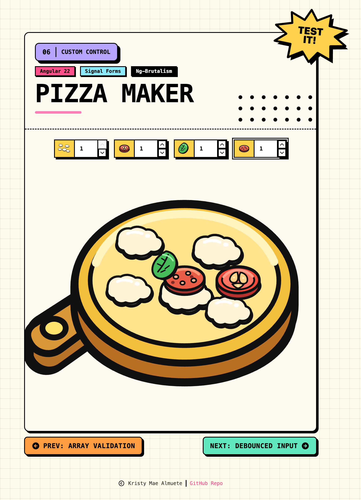

# 06 · Custom Control

> The **custom control** recipe: the same **Pizza Maker**, but each topping row is now a
> bespoke **`FormValueControl`** (`Topping`) instead of a native input. It owns its value
> as a `model()` and a stepper UI (up / down chevrons), and Signal Forms **binds its
> value and field state automatically**: `errors`, `touched`, `dirty`, `invalid`,
> `disabled`, `hidden`. The schema drives that state, `min(0)`, a per-topping `disabled`
> at its max, and a cross-item `hidden` rule (pepperoni disappears while there is more
> than one tomato). No `ReactiveFormsModule`, no `FormBuilder`.

<p align="center">
  
</p>

<p align="center">
  <a href="https://kshewengger.github.io/angular-signal-forms-cookbook/06-custom-control/"><strong>▶ Live Demo</strong></a>
</p>

<p align="center">Part of the <a href="../../README.md">Angular Signal Forms Cookbook</a>.</p>

---

## How to run

Run every command from the **repository root**. This is an Nx integrated monorepo, so
all projects share a single root `package.json`.

| Task                              | Command                                |
| --------------------------------- | -------------------------------------- |
| **Serve** (http://localhost:4206) | `pnpm serve:06-custom-control`         |
| Serve (direct)                    | `pnpm exec nx serve 06-custom-control` |
| Build                             | `pnpm exec nx build 06-custom-control` |
| Test                              | `pnpm exec nx test 06-custom-control`  |

---

## Signal Forms API at a glance

| API                           | What it does                                                                                                  | Where in this recipe                                  |
| ----------------------------- | ------------------------------------------------------------------------------------------------------------- | ----------------------------------------------------- |
| `FormValueControl<T>`         | Interface a component implements to become a form control                                                     | `Topping implements FormValueControl<number>`         |
| `model<T>()`                  | The control's two-way value the framework reads and writes                                                    | `value = model<number>()` in `Topping`                |
| state inputs                  | `errors` / `touched` / `dirty` / `invalid` / `disabled` / `hidden` are bound **automatically** from the field | the `input()`s on `Topping`                           |
| `FormField` / `[formField]`   | Binds the field to the custom control                                                                         | `[formField]="pizzaMakerForm.toppings[$index].count"` |
| `applyEach(path, itemSchema)` | Applies a schema to every element of the array                                                                | `applyEach(path.toppings, …)`                         |
| `disabled(path, { when })`    | Conditionally disables a field (which disables the bound control)                                             | disable a count at its max                            |
| `hidden(path, { when })`      | Conditionally hides a field (which hides the bound control)                                                   | hide pepperoni while tomato > 1                       |
| `min(path, n)` / `validate`   | Field validators                                                                                              | `min(item.count, 0)`                                  |

---

## The custom control

`Topping` is a standalone component that **is** a form control. It implements
`FormValueControl<number | undefined>`, exposes its value as a `model()`, and declares
the well-known **state inputs** Signal Forms fills in for it:

```ts
export class Topping implements FormValueControl<number | undefined> {
  readonly value = model<number>();                 // two-way value
  readonly errors = input<…ValidationError[]>([]);  // ↓ all bound from the field
  readonly touched = input(false);
  readonly invalid = input(false);
  readonly dirty = input(false);
  readonly disabled = input(false);
  readonly hidden = input<boolean>(false);
  readonly touch = output<void>();                  // emitted on blur
  host: { '[class.hidden]': 'hidden()' };           // reacts to the field's hidden state
}
```

Binding it is identical to a native control, just point `[formField]` at the field:

```html
<app-topping [topping]="topping" [formField]="pizzaMakerForm.toppings[$index].count" />
```

You **do not** wire `disabled`, `hidden`, or the errors by hand. The framework reads the
field's state and sets those inputs, which is the whole point of the recipe.

---

## The form and its rules

The model is an array of `{ id, count }`, and one shared schema runs on every item.

| Topping        | Control   | Rules                                                  |
| -------------- | --------- | ------------------------------------------------------ |
| **Mozzarella** | `Topping` | `min(0)` · disabled at **1**                           |
| **Tomato**     | `Topping` | `min(0)` · disabled at **4**                           |
| **Basil**      | `Topping` | `min(0)` · disabled at **3**                           |
| **Pepperoni**  | `Topping` | `min(0)` · disabled at **5** · hidden while tomato > 1 |

```ts
export const pizzaToppingItemSchema = schema<PizzaFormModelItem>((item) => {
  min(item.count, 0, { message: 'No negative' });

  // Disable the field (and so its stepper) once it reaches the topping's max.
  disabled(item.count, {
    when: ({ valueOf }) =>
      valueOf(item.count) >= (PIZZA_TOPPINGS_MAP[valueOf(item.id)]?.max ?? 0),
  });

  // A max validator also exists, but see the note below.
  validate(item.count, ({ value, valueOf }) => { … 'toppingMax' … });
});
```

> **Interaction to know:** `disabled` fires at `count >= max` and a **disabled field runs
> no validators**, so a count can never be `> max` while still validating. The
> `toppingMax` (`Max N`) message is therefore **shadowed** and never surfaces in the UI.
> Reaching the max simply disables the stepper. Keep this in mind if you want the message
> back (e.g. only disable the increment button, not the field).

---

## Conditional hidden (cross-item)

Array elements can't be indexed in a schema, so the rule runs on every item and reads the
sibling tomato from the array value:

```ts
hidden(topping.count, {
  when: ({ valueOf }) => {
    if (valueOf(topping.id) !== 'pepperoni') return false;
    const tomato = valueOf(path.toppings).find((t) => t.id === 'tomato');
    return (tomato?.count ?? 0) > 1;
  },
});
```

Because `Topping` binds the field's `hidden()` to its `hidden` input and has
`host: { '[class.hidden]': 'hidden()' }`, the whole control disappears with no template
change in the parent. `hidden` does **not** clear the value from the model.

---

## Error display

`ValidationErrors` here is a small **presentational** component (it takes `errors` and
`visible` inputs, no field). The custom control feeds it from its own bound state:

```html
<app-validation-errors [errors]="errors()" [visible]="invalid() && (dirty() || touched())" />
```

| Behaviour         | Detail                                                                    |
| ----------------- | ------------------------------------------------------------------------- |
| **When visible**  | Only when the parent passes `visible` **and** there is at least one error |
| **One error**     | A single line                                                             |
| **Many errors**   | A bulleted list (`list-disc`)                                             |
| **Accessibility** | `role="alert"` + `aria-live="polite"`                                     |

---

## Form state

| State    | Signal                                          | True when                              |
| -------- | ----------------------------------------------- | -------------------------------------- |
| Touched  | `pizzaMakerForm.toppings[i]().touched()`        | the user has focused and left an item  |
| Dirty    | `pizzaMakerForm.toppings[i]().dirty()`          | a value differs from its initial value |
| Disabled | `pizzaMakerForm.toppings[i].count().disabled()` | the count is at its max                |
| Hidden   | `pizzaMakerForm.toppings[i].count().hidden()`   | the field's `hidden` rule is active    |
| Valid    | `pizzaMakerForm().valid()`                      | every item passes                      |

---

## Tech & tools

| Layer     | Tool                                                                | Purpose                                                     |
| --------- | ------------------------------------------------------------------- | ----------------------------------------------------------- |
| Framework | **Angular 22** (standalone, signals, new control flow `@for`/`@if`) | Application shell and reactivity                            |
| Forms     | **`@angular/forms/signals`**                                        | `FormValueControl`, `applyEach()`, `disabled()`, `hidden()` |
| UI kit    | **ng-brutalism** (`@ng-brutalism/ui`)                               | `nb-input-group`, `nbIconButton`, `nbHalftone`, …           |
| Icons     | **`@ng-icons/tabler-icons`**                                        | Stepper chevrons and navigation icons                       |
| Styling   | **Tailwind CSS v4** (with the ng-brutalism theme)                   | Utility classes, plus the control's disabled-state styling  |
| Images    | **`NgOptimizedImage`**                                              | Optimized topping and board SVGs                            |
| i18n      | **`@angular/localize`**                                             | Translatable user-facing strings                            |
| Tooling   | **Nx 23** + **esbuild**                                             | Build, serve, and dependency graph                          |
| Tests     | **Vitest 4**                                                        | Isolated schema tests + component tests                     |

---

## How it works

**1. Model the data as an array** (`app.model.ts`)

```ts
export type PizzaFormModelItem = { id: PizzaToppingId; count: number };
export type PizzaFormModel = { toppings: PizzaFormModelItem[] };
```

**2. Declare the schema (validators + state logic)** (`app.schema.ts`)

`pizzaToppingItemSchema` is a `schema()` object because `applyEach` runs it on every
item. Isolated tests import `pizzaMakerSchema`.

```ts
export function pizzaMakerSchema(path: SchemaPathTree<PizzaFormModel>): void {
  applyEach(path.toppings, (topping) => {
    apply(topping, pizzaToppingItemSchema);
    hidden(topping.count, { when: /* pepperoni while tomato > 1 */ });
  });
}
```

**3. Build the form** (`app.ts`)

```ts
protected pizzaMakerForm = form(this.pizzaMakerModel, pizzaMakerSchema);
```

**4. Implement and bind the custom control** (`topping.ts` + `app.html`)

```html
<app-topping [topping]="topping" [formField]="pizzaMakerForm.toppings[$index].count" />
```

---

## Testing

Following the [Signal Forms testing guide](https://angular.dev/guide/forms/signals/testing),
tests are split by concern:

- **Isolated schema tests** build the form directly from `pizzaMakerSchema`
  (`form(model, pizzaMakerSchema, { injector })`) - no component, no DOM - and assert the
  rules: `min` rejects negatives, each topping is `disabled()` at its max (and a disabled
  field runs no validators), and pepperoni is `hidden()` only while tomato > 1.
- **Component tests** cover the custom control end to end: a control renders per topping,
  incrementing flows the value into the form, toppings reveal on the board, the increment
  button disables at the max, and pepperoni's control hides when tomato reaches 2.
- **`ValidationErrors`** is tested against its `errors` / `visible` inputs.

---

## Internationalization

Every user-facing string is translatable. Template text uses `i18n="@@stableId"` and
TypeScript strings use the `$localize` tagged template. The `@angular/localize/init`
polyfill is wired in `project.json` (build) and `test-setup.ts` (tests). Keep the
`@@` IDs stable; they are the translation contract.
