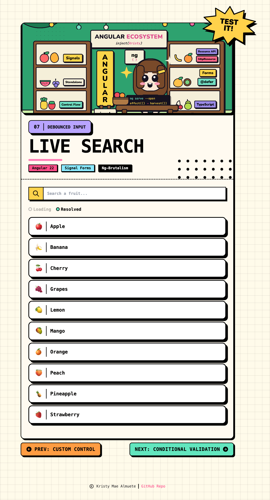

# 07 · Debounced Input

> The **debounce** recipe: a neo-brutalist **Live Search** where a single `query` field
> feeds a fruit search. The one concept is **`debounce(path.query, ms)`**, which holds
> typed input out of the model until the user pauses, so validation (`pattern` +
> a custom `unknownFruit` rule) and the async lookup only run once per pause instead of
> on every keystroke. The debounced value drives an **`rxResource`** that streams matches
> from a `@Service`, and a status row lights up as the resource loads and resolves. No
> `ReactiveFormsModule`, no `FormBuilder`.

<p align="center">
  
</p>

<p align="center">
  <a href="https://kshewengger.github.io/angular-signal-forms-cookbook/07-debounce-input/"><strong>▶ Live Demo</strong></a>
</p>

<p align="center">Part of the <a href="../../README.md">Angular Signal Forms Cookbook</a>.</p>

---

## How to run

Run every command from the **repository root**. This is an Nx integrated monorepo, so
all projects share a single root `package.json`.

| Task                              | Command                                |
| --------------------------------- | -------------------------------------- |
| **Serve** (http://localhost:4207) | `pnpm serve:07-debounce-input`         |
| Serve (direct)                    | `pnpm exec nx serve 07-debounce-input` |
| Build                             | `pnpm exec nx build 07-debounce-input` |
| Test                              | `pnpm exec nx test 07-debounce-input`  |

---

## Signal Forms API at a glance

| API                         | What it does                                                       | Where in this recipe                           |
| --------------------------- | ------------------------------------------------------------------ | ---------------------------------------------- |
| `debounce(path, ms)`        | Delays syncing **typed** input into the model until the user stops | `debounce(path.query, 400)` in `app.schema.ts` |
| `form(model, schemaFn)`     | Builds a form from the model signal and a schema function          | `searchForm = form(searchModel, searchSchema)` |
| `pattern(path, regexp)`     | Built-in regex validator                                           | `pattern(path.query, QUERY_PATTERN, …)`        |
| `validate(path, fn)`        | Custom validator; here it flags a query that matches no fruit      | the `unknownFruit` rule                        |
| `field().valid()`           | Whether a field currently passes every rule                        | gates the `rxResource` params                  |
| `field().errors()`          | The errors on a leaf field (each has `kind` + `message`)           | `ValidationErrors` reads the `query` field     |
| `FormField` / `[formField]` | Binds a native control to a field                                  | `[formField]="searchForm.query"`               |

---

## The form

A single text field drives the whole recipe. Its debounced value is what everything
downstream (validation and the search) reacts to.

| Field     | Control   | Type   | Validation                                            |
| --------- | --------- | ------ | ----------------------------------------------------- |
| **query** | `nbInput` | string | `pattern` (letters, numbers, spaces) · `unknownFruit` |

An empty query is valid and lists every fruit.

---

## Debounce

This is the recipe's core idea: hold the typed value out of the model until the user
pauses, so the expensive work (validation and the search) runs once per pause, not once
per keystroke.

```ts
export function searchSchema(path: SchemaPathTree<SearchFormModel>): void {
  pattern(path.query, QUERY_PATTERN, {
    message: 'No special characters allowed.',
  });

  validate(path.query, ({ value }) => {
    const raw = value();
    const q = raw.trim().toLowerCase();

    if (!q || !QUERY_PATTERN.test(raw)) return null;

    return FRUITS.some((fruit) => fruit.name.toLowerCase().includes(q)) ? null : { kind: 'unknownFruit', message: `Try one of: ${ALLOWED_FRUITS}.` };
  });

  debounce(path.query, 400); // <- the one concept
}
```

| Piece                | Detail                                                                       |
| -------------------- | ---------------------------------------------------------------------------- |
| **`debounce`**       | Only delays **typed** (UI) input; a direct `value.set()` still syncs at once |
| **Runs after pause** | `pattern`, `unknownFruit`, and the search all read the settled model value   |
| **`unknownFruit`**   | Skips work while the query is empty or the pattern is violated               |
| **Reused in tests**  | The extracted `searchSchema` builds the same form without a component        |

---

## The live search

The debounced, valid query feeds an `rxResource` whose stream comes from an injectable
`@Service`. While it loads or resolves, a status row lights up the matching dot.

```ts
private searchResource = rxResource({
  params: () =>
    this.searchForm.query().valid() ? this.query().trim() : undefined,
  stream: ({ params }) => this.fruitSearch.search(params),
});
```

`params` returns `undefined` while the query is invalid, which parks the resource in its
idle state; a valid query (including the empty one) becomes a real param and runs the
search. The `Loading` and `Resolved` badges only light once the field is `dirty`, so a
fresh page load shows neither.

---

## Error display

The reusable `ValidationErrors` component is bound to the `query` field's `errors()` and
its `visible` flag, so messages appear only when the field is touched or dirty and invalid.

| Behaviour         | Detail                                                                      |
| ----------------- | --------------------------------------------------------------------------- |
| **When visible**  | Only once the field is `touched` **or** `dirty` **and** `invalid`           |
| **One error**     | A single line (a `pattern` violation short-circuits `unknownFruit`)         |
| **Many errors**   | A `list-disc` bullet list, one line per message                             |
| **Accessibility** | `role="alert"` + `aria-live="polite"` so screen readers announce the errors |

---

## Form state

Signal Forms exposes each field's status as a signal you read directly in the template.

| State   | Signal                         | True when                                |
| ------- | ------------------------------ | ---------------------------------------- |
| Touched | `searchForm.query().touched()` | the user has focused and left the field  |
| Dirty   | `searchForm.query().dirty()`   | the value differs from its initial value |
| Valid   | `searchForm.query().valid()`   | the query passes both rules              |
| Invalid | `searchForm.query().invalid()` | the query fails a rule                   |

---

## Tech & tools

| Layer     | Tool                                                                | Purpose                                                                                        |
| --------- | ------------------------------------------------------------------- | ---------------------------------------------------------------------------------------------- |
| Framework | **Angular 22** (standalone, signals, new control flow `@for`/`@if`) | Application shell and reactivity                                                               |
| Forms     | **`@angular/forms/signals`**                                        | `form()`, `debounce()`, `pattern()`, `validate()`                                              |
| Async     | **`rxResource`** + a `@Service`                                     | Streams the fruit matches for the debounced query                                              |
| UI kit    | **ng-brutalism** (`@ng-brutalism/ui`)                               | `nb-card`, `nbMediaFrame`, `nbInput`, `nbCallout`, `nbStatusDot`, `nbHalftone`, `nbSticker`, … |
| Icons     | **`@ng-icons/tabler-icons`**                                        | Search, copyright, and lesson-navigation icons                                                 |
| Styling   | **Tailwind CSS v4** (with the ng-brutalism theme)                   | Utility classes plus the invalid-input border override                                         |
| Images    | **`NgOptimizedImage`** + native emoji                               | Priority `hero-cover.png` header; fruit rows render emoji directly                             |
| i18n      | **`@angular/localize`**                                             | Translatable user-facing strings                                                               |
| Tooling   | **Nx 23** + **esbuild**                                             | Build, serve, and dependency graph                                                             |
| Tests     | **Vitest 4**                                                        | Isolated schema tests + component tests                                                        |

---

## How it works

**1. Model the query as a signal** (`app.model.ts`)

```ts
export type SearchFormModel = { query: string };
export const INITIAL_SEARCH: SearchFormModel = { query: '' };
```

**2. Declare the schema with the debounce** (`app.schema.ts`)

A named schema function (not `schema()`) is enough when the rules are used on one form.
Isolated tests import the same function.

```ts
export function searchSchema(path: SchemaPathTree<SearchFormModel>): void {
  pattern(path.query, QUERY_PATTERN, { message: 'No special characters allowed.' });
  validate(path.query /* unknownFruit rule */);
  debounce(path.query, 400);
}
```

**3. Build the form and wire the search** (`app.ts`)

```ts
protected searchForm = form(this.searchModel, searchSchema);

private searchResource = rxResource({
  params: () => (this.searchForm.query().valid() ? this.query().trim() : undefined),
  stream: ({ params }) => this.fruitSearch.search(params),
});
```

**4. Bind the control, show errors, render results** (`app.html`)

```html
<input nbInput [formField]="searchForm.query" placeholder="Search a fruit..." />
<app-validation-errors [errors]="queryErrors()" [visible]="queryInvalid()" />

@for (fruit of results(); track fruit.name) {
<div nbCallout tone="background">{{ fruit.emoji }} {{ fruit.name }}</div>
}
```

---

## Testing

Following the [Signal Forms testing guide](https://angular.dev/guide/forms/signals/testing),
tests are split by concern:

- **Isolated schema tests** build the form directly from `searchSchema`
  (`form(model, searchSchema, { injector })`) - no component, no DOM - and assert the
  rules: an empty or matching query is valid, a partial and case-insensitive match passes,
  a special character raises `pattern`, and a query that matches no fruit raises
  `unknownFruit`. Because `debounce` only delays typed input, a direct `value.set()`
  validates synchronously.
- **Component tests** cover only what the rendered template shows: the search input and
  status badges, the `pattern` and `unknownFruit` messages after the field is touched, and
  the results narrowing to the single matching fruit once a valid query resolves.
- **`ValidationErrors`** is tested against the real field messages, so its rendering is
  verified against the actual recipe errors.

---

## Internationalization

Every user-facing string is translatable. Template text uses `i18n="@@stableId"` and
TypeScript strings use the `$localize` tagged template. The `@angular/localize/init`
polyfill is wired in `project.json` (build) and `test-setup.ts` (tests). Keep the
`@@` IDs stable; they are the translation contract.
