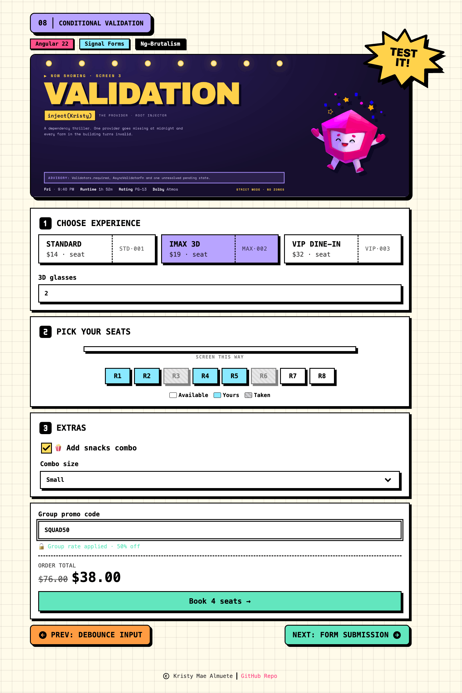

# 08 · Conditional Validation

> The **conditional validation** recipe: a neo-brutalist **Starlight Cinema** checkout
> where rules and even the disabled state switch on based on _other_ fields. Picking an
> experience narrows a discriminated union with **`applyWhenValue`** (IMAX requires
> `glasses`, VIP requires a `mealChoice`); every seat is validated with **`applyEach`**; a
> snacks toggle turns a combo requirement on with **`applyWhen`**; and the promo code stays
> **`disabled`** (via a **`when`** predicate) until four seats are booked, then a custom
> **`validate`** rejects anything but the real code (`"Invalid coupon."`). No
> `ReactiveFormsModule`, no `FormBuilder`.

<p align="center">
  
</p>

<p align="center">Part of the <a href="../../README.md">Angular Signal Forms Cookbook</a>.</p>

---

## How to run

Run every command from the **repository root**. This is an Nx integrated monorepo, so
all projects share a single root `package.json`.

| Task                              | Command                                        |
| --------------------------------- | ---------------------------------------------- |
| **Serve** (http://localhost:4208) | `pnpm serve:08-conditional-validation`         |
| Serve (direct)                    | `pnpm exec nx serve 08-conditional-validation` |
| Build                             | `pnpm exec nx build 08-conditional-validation` |
| Test                              | `pnpm exec nx test 08-conditional-validation`  |

---

## Signal Forms API at a glance

| API                               | What it does                                                       | Where in this recipe                                   |
| --------------------------------- | ------------------------------------------------------------------ | ------------------------------------------------------ |
| `applyWhenValue(path, guard, fn)` | Applies rules to a **discriminated-union** variant, with narrowing | IMAX `glasses`, VIP `mealChoice`                       |
| `applyEach(path, itemSchema)`     | Applies rules to **every element** of an array field               | `applyEach(path.tickets, …)` → `required(ticket.seat)` |
| `applyWhen(path, predicate, fn)`  | Applies a sub-schema **only while** a predicate holds              | `applyWhen(addSnacks)` → `required(comboSize)`         |
| `disabled(path, { when })`        | Marks a field disabled reactively (skips its validators)           | `disabled(promoCode, when: tickets.length < 4)`        |
| `validate(path, fn)`              | Custom validator returning a `{ kind, message }` error             | the `invalidCoupon` rule on `promoCode`                |
| `required` / `min`                | Built-in validators, applied conditionally by the operators above  | `glasses`, `mealChoice`, `comboSize`, `seat`           |
| `field().disabled()`              | Reads a field's schema-driven disabled state                       | `promoDisabled` computed                               |
| `submit(form, action)`            | Marks every field touched, then runs the action if valid           | `book()` flips the button to "Reserved"                |
| `FormField` / `[formField]`       | Binds a native control (input, checkbox, `nb-select`) to a field   | `[formField]="bookingForm.promoCode"`                  |
| `form(model, schema)`             | Builds a form from the model signal and the schema                 | `bookingForm = form(model, bookingSchema)`             |

---

## The form

Every rule below is **conditional**: it exists only while the field it depends on says so.

| Field        | Control        | Conditional rule                                                           |
| ------------ | -------------- | -------------------------------------------------------------------------- |
| `experience` | ticket buttons | union variant: IMAX → `required` + `min(1)` glasses; VIP → `required` meal |
| `tickets[]`  | seat grid      | `applyEach` → `required(seat)` on every selected seat                      |
| `addSnacks`  | checkbox       | when `true`, `applyWhen` → `required(comboSize)`                           |
| `comboSize`  | `nb-select`    | required only while snacks are on                                          |
| `promoCode`  | text input     | `disabled` until 4+ seats; then `validate` → must equal the real code      |

---

## Conditional validation

This is the recipe's core idea: a rule is not always present. The schema operators decide
**whether a rule exists** from the current value of another field, so the form re-shapes
itself as the user fills it in.

```ts
export const bookingSchema = schema<Booking>((path) => {
  // applyEach — one rule set for every ticket in the array
  applyEach(path.tickets, (ticket) => required(ticket.seat));

  // applyWhen — comboSize is required only while snacks are on
  applyWhen(
    path,
    ({ valueOf }) => valueOf(path.addSnacks),
    (path) => required(path.comboSize),
  );

  // applyWhenValue — narrows the union, so each variant validates its own field
  applyWhenValue(
    path.experience,
    (e): e is Extract<Experience, { format: 'imax' }> => e.format === 'imax',
    (imax) => {
      required(imax.glasses);
      min(imax.glasses, 1);
    },
  );
  applyWhenValue(
    path.experience,
    (e): e is Extract<Experience, { format: 'vip' }> => e.format === 'vip',
    (vip) => required(vip.mealChoice),
  );

  // when — the promo field is disabled (and skips its own validator) under 4 seats
  disabled(path.promoCode, {
    when: ({ valueOf }) => valueOf(path.tickets).length < 4,
  });

  // validate — once unlocked, an entered code must be the real one
  validate(path.promoCode, ({ value }) => {
    const code = value().trim();
    if (!code || code.toUpperCase() === PROMO_CODE) return null;
    return { kind: 'invalidCoupon', message: 'Invalid coupon.' };
  });
});
```

| Operator            | Depends on      | Effect when the condition flips                                    |
| ------------------- | --------------- | ------------------------------------------------------------------ |
| `applyEach`         | array length    | rules apply to every element, including seats added later          |
| `applyWhenValue`    | the variant tag | only the active variant's fields are validated; TS narrows too     |
| `applyWhen`         | `addSnacks`     | `comboSize` becomes required; turn it off and the rule disappears  |
| `disabled` + `when` | seat count      | a disabled field is skipped entirely, so a stale code never errors |

---

## The checkout (`when` in action)

The promo code is the clearest `when` payoff. Its `disabled` state comes **straight from
the schema**, so the component never disables the input by hand, it just reads it:

```ts
protected readonly promoDisabled = computed(() =>
  this.bookingForm.promoCode().disabled(),
);
```

Under four seats the `[formField]` binding auto-disables the input; reach four and it
unlocks, the placeholder switches to the example code, and the custom `validate` starts
enforcing it. A valid code halves the total (shown with the subtotal struck through), and
`submit()` flips the Book button to a "Reserved" state.

---

## Error display

Each conditional field shows a single tailored message, gated the moment the user has
engaged with it. The gate is one named `computed` per field:

```ts
protected readonly glassesInvalid = computed(() => {
  if (this.selectedFormat() !== 'imax') return false;
  const field = this.glassesField();
  return (field.dirty() || field.touched()) && field.invalid();
});
```

| Field        | Message                             | Shows when                                     |
| ------------ | ----------------------------------- | ---------------------------------------------- |
| `glasses`    | "Enter at least 1 pair of glasses." | IMAX selected, field touched or dirty, invalid |
| `mealChoice` | "Pick a dish to continue."          | VIP selected, select closed or dirty, invalid  |
| `comboSize`  | "Choose a combo size."              | snacks on, select closed or dirty, invalid     |
| `promoCode`  | "Invalid coupon."                   | unlocked, a wrong code entered, touched        |

---

## Form state

Signal Forms exposes each field's status as a signal you read directly in the template.

| State    | Signal                               | True when                                 |
| -------- | ------------------------------------ | ----------------------------------------- |
| Disabled | `bookingForm.promoCode().disabled()` | fewer than four seats are selected        |
| Invalid  | `field().invalid()`                  | a currently-active rule fails             |
| Touched  | `field().touched()`                  | the user has focused and left the control |
| Valid    | `bookingForm().valid()`              | every active conditional rule passes      |

`canBook` combines `bookingForm().valid()` with at least one seat, so the Book button
gates on the whole form's conditional validity.

---

## Tech & tools

| Layer     | Tool                                                                    | Purpose                                                                   |
| --------- | ----------------------------------------------------------------------- | ------------------------------------------------------------------------- |
| Framework | **Angular 22** (standalone, signals, new control flow `@for`/`@switch`) | Application shell and reactivity                                          |
| Forms     | **`@angular/forms/signals`**                                            | `applyWhen`, `applyWhenValue`, `applyEach`, `disabled`, `validate`        |
| UI kit    | **ng-brutalism** (`@ng-brutalism/ui`)                                   | `nb-surface`, `nbButton`, `nbInput`, `nb-select`, `nbCheckbox`, `nbSplit` |
| Icons     | **`@ng-icons/tabler-icons`**                                            | Step numbers, lesson nav, the "Reserved" check                            |
| Styling   | **Tailwind CSS v4** (with the ng-brutalism theme)                       | Utility classes plus the taken-seat hatch in `app.css`                    |
| Images    | **`NgOptimizedImage`**                                                  | The priority `hero-cover.png` marquee                                     |
| i18n      | **`@angular/localize`**                                                 | Translatable user-facing strings                                          |
| Tooling   | **Nx 23** + **esbuild**                                                 | Build, serve, and dependency graph                                        |
| Tests     | **Vitest 4**                                                            | Isolated schema tests + component tests                                   |

---

## How it works

**1. Model the booking, with a discriminated union for the experience** (`app.model.ts`)

```ts
export type Experience = { format: 'standard' } | { format: 'imax'; glasses: number | null } | { format: 'vip'; mealChoice: string };

export type Booking = {
  tickets: { seat: string }[];
  addSnacks: boolean;
  comboSize: string;
  experience: Experience;
  promoCode: string;
};
```

**2. Declare the conditional schema** (`app.model.ts`)

Extracting the schema keeps it reusable: the component builds its form from it, and the
tests build the same form in isolation. Each operator gates a rule on another field (see
[Conditional validation](#conditional-validation)).

**3. Build the form** (`app.ts`)

```ts
protected readonly bookingForm = form(this.bookingModel, bookingSchema);
```

**4. Reach a union variant's field with a narrow cast** (`app.ts`)

The union's `FieldTree` only exposes the shared `format` key, so a small guarded accessor
narrows to the active variant. The template reads it only inside the matching `@case`.

```ts
protected get glassesField(): FieldTree<number | null> {
  return this.variant<ImaxExperience>().glasses;
}
```

**5. Bind controls and reveal fields conditionally** (`app.html`)

```html
@switch (selectedFormat()) { @case ('imax') {
<input nbInput id="glasses" type="number" [formField]="glassesField" />
} @case ('vip') {
<nb-select id="meal" [formField]="mealField"> … </nb-select>
} }
```

---

## Testing

Following the [Signal Forms testing guide](https://angular.dev/guide/forms/signals/testing),
tests are split by concern:

- **Isolated schema tests** build the form directly from `bookingSchema`
  (`form(model, bookingSchema, { injector })`) - no component, no DOM - and assert every
  conditional rule: the IMAX/VIP variant requirements, the per-seat `required`, the snacks
  `applyWhen`, the promo `disabled` gate (a wrong code is ignored while disabled), and the
  `invalidCoupon` message once unlocked.
- **Component tests** cover only what the template shows: the controls render, the glasses
  field / meal select / combo size reveal with their messages, the promo input disables
  under four seats, and the Book button gates on the whole form's validity.
- The recipe shows errors **inline** (one tailored message per conditional field) rather
  than through a shared `ValidationErrors` component, so those messages are asserted in the
  component tests.

---

## Internationalization

Every user-facing string is translatable. Template text uses `i18n="@@stableId"` and
TypeScript strings use the `$localize` tagged template. The `@angular/localize/init`
polyfill is wired in `project.json` (build) and `test-setup.ts` (tests). Keep the
`@@` IDs stable; they are the translation contract.
