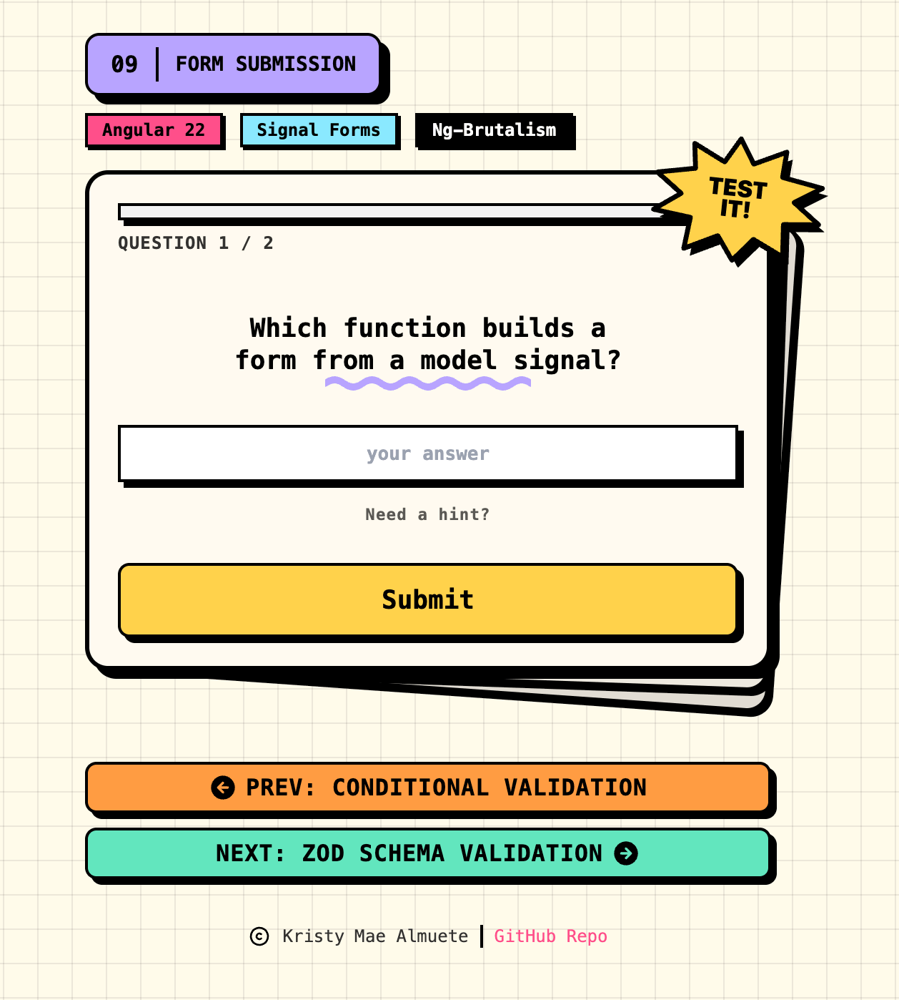

# 09 · Form Submission

> The **form submission** recipe: a neo-brutalist **Signals Pop Quiz** dealt as a
> flashcard deck. Every card is _one form submission_, you answer, hit **Submit**, and a
> mock server (`GraderService`) grades it. Its verdict routes straight back onto the field
> via **`submit()`** / the **`[formRoot]`** directive: a wrong answer returns a
> field-targeted error (`fieldTree`), running out of tries returns a **form-level** error
> that locks the deck, and a correct answer resolves the submission and deals the next
> card. No `ReactiveFormsModule`, no `FormBuilder`.

<p align="center">
  
</p>

<p align="center">Part of the <a href="../../README.md">Angular Signal Forms Cookbook</a>.</p>

---

## How to run

Run every command from the **repository root**. This is an Nx integrated monorepo, so
all projects share a single root `package.json`.

| Task                              | Command                                 |
| --------------------------------- | --------------------------------------- |
| **Serve** (http://localhost:4209) | `pnpm serve:09-form-submission`         |
| Serve (direct)                    | `pnpm exec nx serve 09-form-submission` |
| Build                             | `pnpm exec nx build 09-form-submission` |
| Test                              | `pnpm exec nx test 09-form-submission`  |

---

## Signal Forms API at a glance

| API                                           | What it does                                                                     | Where in this recipe                        |
| --------------------------------------------- | -------------------------------------------------------------------------------- | ------------------------------------------- |
| `form(model, schema, { submission })`         | Configures the submission `action`, `onInvalid`, and `ignoreValidators`          | `answerForm`                                |
| `[formRoot]`                                  | Wires a native `<form>` to submit the form (sets `novalidate`, prevents default) | `<form [formRoot]="answerForm">`            |
| `field().submitting()`                        | `true` while the async action runs, drives the spinner + double-submit guard     | the Submit button                           |
| action returns `undefined`                    | Submission succeeded                                                             | correct answer → deal the next card         |
| action returns `{ kind, message, fieldTree }` | A **field-level** server error                                                   | wrong answer → error under the card         |
| action returns `{ kind, message }`            | A **form-level** (root) server error                                             | out of tries → the deck locks               |
| `onInvalid` + `focusBoundControl()`           | Runs when validation blocks the submit; focuses the first invalid field          | submit an empty card                        |
| `ignoreValidators: 'none'`                    | Pending validators block submission                                              | configured on `answerForm`                  |
| `submit(form, action)` → `Promise<boolean>`   | Manual submission that resolves `true`/`false`                                   | the alternative to `[formRoot]` (see below) |
| `required`                                    | Client rule that gates the action                                                | `required(path.answer)`                     |

---

## The form

The whole quiz runs on **one reusable single-field form**, reset between cards:

```ts
export type QuizAnswer = { answer: string };

export const answerSchema = schema<QuizAnswer>((path) => {
  required(path.answer, { message: 'Answer this question before submitting.' });
});
```

Each card binds the same field, the text card with `[formField]`, the multiple-choice card
by writing the selected option into `answerForm.answer().value`.

---

## Submission (the recipe's core idea)

The submission is configured **on `form()`**, and the native `<form [formRoot]>` triggers it.
The `action` is where the server lives: it grades the answer and **returns** the result as
errors, exactly the three shapes the guide describes.

```ts
protected readonly answerForm = form(this.answerModel, answerSchema, {
  submission: {
    action: (field) => this.gradeSubmission(field),
    onInvalid: (field) =>
      field().errorSummary()[0]?.fieldTree().focusBoundControl(),
    ignoreValidators: 'none',
  },
});

private async gradeSubmission(field: FieldTree<QuizAnswer>) {
  const question = this.currentQuestion();
  const correct = await this.grader.grade(question.id, field.answer().value());

  if (correct) {
    queueMicrotask(() => this.advance()); // success → deal the next card
    return undefined;
  }

  const remaining = this.hearts() - 1;
  this.hearts.set(remaining);

  if (remaining <= 0) {
    queueMicrotask(() => this.phase.set('locked'));
    return { kind: 'locked', message: 'Out of tries, the deck is locked.' }; // form-level
  }

  return { kind: 'wrongAnswer', message: 'Not quite, try again.', fieldTree: field.answer }; // field-level
}
```

| Return value                         | Kind of error | Effect                                                   |
| ------------------------------------ | ------------- | -------------------------------------------------------- |
| `undefined`                          | none          | submission succeeds, the deck advances                   |
| `{ kind, message, fieldTree }`       | field-level   | the message shows under the answer, a try is spent       |
| `{ kind, message }` (no `fieldTree`) | form-level    | the deck locks; the message reads from `form().errors()` |

> **`[formRoot]` vs `submit()`.** `[formRoot]` submits declaratively from the template
> (used here). The manual `submit(answerForm, action)` returns a `Promise<boolean>` you can
> `await` to branch on success, handy when you would rather advance from a click handler
> than from inside the action.

---

## Error display

Submission errors attach to a field (or the form root) and, per the guide, **clear the
moment the user edits that field**, so a wrong answer's red state disappears as soon as you
change your answer to try again.

| Message                                   | Level            | Shows when                                         |
| ----------------------------------------- | ---------------- | -------------------------------------------------- |
| "Answer this question before submitting." | field (required) | submit an empty card (`onInvalid` also focuses it) |
| "Not quite, try again."                   | field (server)   | a wrong answer, tries remaining                    |
| "Out of tries, the deck is locked."       | form (server)    | the last try is spent                              |

---

## Form state

| State      | Signal                          | True when                                     |
| ---------- | ------------------------------- | --------------------------------------------- |
| Submitting | `answerForm().submitting()`     | the grading action is in flight               |
| Invalid    | `answerForm.answer().invalid()` | the answer is empty or carries a server error |
| Touched    | `answerForm.answer().touched()` | after a submit attempt (submit marks touched) |
| Form error | `answerForm().errors()`         | a form-level (root) server error is present   |

---

## Tech & tools

| Layer     | Tool                                                                          | Purpose                                                           |
| --------- | ----------------------------------------------------------------------------- | ----------------------------------------------------------------- |
| Framework | **Angular 22** (standalone, signals, new control flow `@if`/`@for`/`@switch`) | Application shell and reactivity                                  |
| Forms     | **`@angular/forms/signals`**                                                  | `form()`, `[formRoot]`, `submit()`, `submitting()`, server errors |
| UI kit    | **ng-brutalism** (`@ng-brutalism/ui`)                                         | `nbButton`, `nbInput`, `nbText`, `nbCluster`, `nbSeparator`       |
| Icons     | **`@ng-icons/tabler-icons`**                                                  | Lesson-nav arrows, footer copyright                               |
| Styling   | **Tailwind CSS v4** (with the ng-brutalism theme)                             | Utility classes plus the card deck / animations in `app.css`      |
| i18n      | **`@angular/localize`**                                                       | Translatable user-facing strings                                  |
| Tooling   | **Nx 23** + **esbuild**                                                       | Build, serve, and dependency graph                                |
| Tests     | **Vitest 4**                                                                  | Isolated schema + grader-service + component tests                |

---

## How it works

**1. Model the answer and the questions** (`app.model.ts`, `app.data.ts`)

One `{ answer: string }` field drives every card; the `QUESTIONS` array holds the prompts,
the correct answers, and the multiple-choice options.

**2. Keep the schema testable** (`app.schema.ts`)

`answerSchema` exports `required(path.answer)`. The component builds its form from it, and
the tests build the same form in isolation.

**3. Configure submission** (`app.ts`)

`form(model, schema, { submission: { action, onInvalid, ignoreValidators } })`. The `action`
calls the mock `GraderService` and returns the field / form-level errors above.

**4. Submit from the template** (`app.html`)

```html
<form [formRoot]="answerForm">
  <input nbInput [formField]="answerField" />
  <button type="submit" [disabled]="submitting()">@if (submitting()) { Checking… } @else { Submit }</button>
</form>
```

---

## Testing

Following the [Signal Forms testing guide](https://angular.dev/guide/forms/signals/testing),
tests are split by concern:

- **Isolated schema tests** build the form directly from `answerSchema` and assert the
  `required` rule.
- **Grader-service tests** exercise the mock server directly (correct/incorrect answers,
  case-insensitive matching, unknown questions), with `GRADER_LATENCY_MS` provided as `0`.
- **Component tests** cover the submission lifecycle through the DOM: the first card renders,
  an empty submit is blocked and reports the required error (`onInvalid`), a correct answer
  advances the deck, a wrong answer shows the field error and spends a try, and the last
  try locks the deck with the form-level error.

---

## Internationalization

Every user-facing string is translatable. Template text uses `i18n="@@stableId"` and
TypeScript strings (the questions, the server messages) use the `$localize` tagged template.
The `@angular/localize/init` polyfill is wired in `project.json` (build) and `test-setup.ts`
(tests). Keep the `@@` IDs stable; they are the translation contract.
