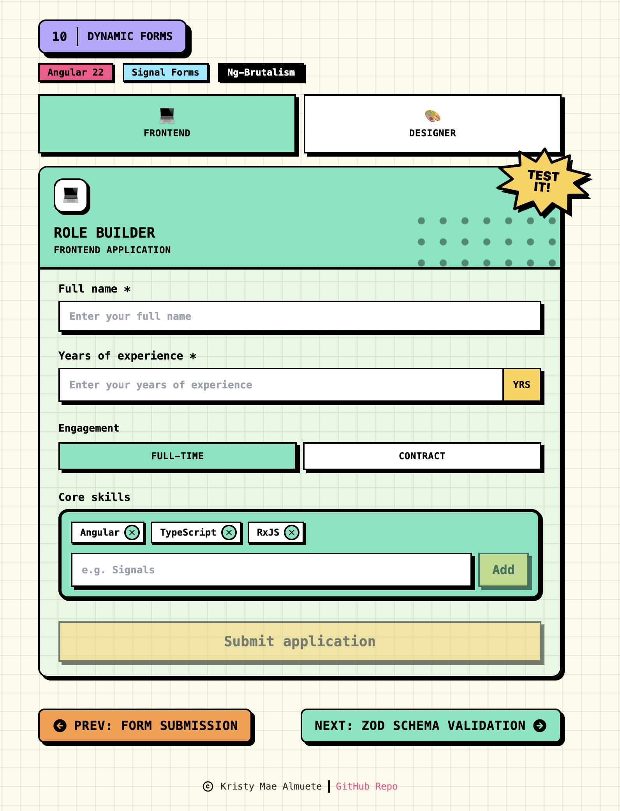

# 10 · Dynamic Forms

> The **dynamic forms** recipe: a neo-brutalist **Role Builder** that reshapes both the
> model and the UI from the selected role. Frontend and designer are two variants of one
> discriminated union; **`applyWhenValue`** narrows the schema so designer gets a required
> portfolio URL and contract engagement gets a required day rate. Switching tabs calls
> **`form().reset(createApplication(role))`** so the form is pristine again. Submit uses
> **`[formRoot]`** with a mock delay so **`submitting()`** can drive the spinner. No
> `ReactiveFormsModule`, no `FormBuilder`.

<p align="center">
  
</p>

<p align="center">Part of the <a href="../../README.md">Angular Signal Forms Cookbook</a>.</p>

---

## How to run

Run every command from the **repository root**. This is an Nx integrated monorepo, so
all projects share a single root `package.json`.

| Task                              | Command                               |
| --------------------------------- | ------------------------------------- |
| **Serve** (http://localhost:4210) | `pnpm serve:10-dynamic-forms`         |
| Serve (direct)                    | `pnpm exec nx serve 10-dynamic-forms` |
| Build                             | `pnpm exec nx build 10-dynamic-forms` |
| Test                              | `pnpm exec nx test 10-dynamic-forms`  |

---

## Signal Forms API at a glance

| API                                   | What it does                                                                       | Where in this recipe                               |
| ------------------------------------- | ---------------------------------------------------------------------------------- | -------------------------------------------------- |
| `applyWhenValue(path, guard, fn)`     | Applies rules to a **discriminated-union** variant, with narrowing                 | designer `portfolio`, contract `dayRate`           |
| `applyEach(path, itemSchema)`         | Applies rules to **every element** of an array field                               | `skillItemSchema` on each chip                     |
| `debounce(path, ms)`                  | Delays UI-to-model sync until the user pauses typing                               | skill composer draft                               |
| `form(model, schema, { submission })` | Configures the submission `action`, `onInvalid`, and `ignoreValidators`            | `applicationForm`                                  |
| `[formRoot]`                          | Wires a native `<form>` to submit (sets `novalidate`, prevents default)            | child `<form [formRoot]="form()">`                 |
| `field().submitting()`                | `true` while the async action runs; drives the spinner and the double-submit guard | the Submit button                                  |
| `onInvalid` + `focusBoundControl()`   | Runs when client validation blocks the submit; focuses the first invalid field     | submit an empty application                        |
| `form().reset(value)`                 | Restores the model and interaction state to a pristine snapshot                    | role tab switch                                    |
| `FormField` / `[formField]`           | Binds a native control to a field                                                  | name, years, portfolio, day rate, skill draft      |
| `form(model, schema)`                 | Builds a form from the model signal and the schema                                 | `applicationForm = form(model, applicationSchema)` |

---

## The form

One `Application` union, two UIs. Shared fields always validate; variant fields only exist
while their discriminant is active.

| Field                | Control                     | Type                       | Validation                           |
| -------------------- | --------------------------- | -------------------------- | ------------------------------------ |
| `role`               | role tab buttons            | `'frontend' \| 'designer'` | discriminant; not a typed input      |
| `name`               | `nbInput`                   | `string`                   | `required`                           |
| `years`              | `nbInput` number            | `number \| null`           | `required`, `min(0)`, `max(10)`      |
| `engagement.kind`    | toggle buttons              | `'fulltime' \| 'contract'` | swapped via `createEngagement`       |
| `engagement.dayRate` | `nbInput` number (contract) | `number \| null`           | `required` + `min(1)` while contract |
| `skills[]`           | chips + composer input      | `string[]`                 | `applyEach` + `skillItemSchema`      |
| composer `skill`     | add input (sibling form)    | `string`                   | `required` + `pattern` + `debounce`  |
| `portfolio`          | `nbInput` url (designer)    | `string`                   | `required` + http(s) URL `pattern`   |

```ts
export type Application = FrontendApplication | DesignerApplication;
```

Each role binds the same `FieldTree<Application>`. The designer child reaches `portfolio`
through a narrowed `FieldTree<DesignerApplication>` cast, the same hole 08 hits on
experience variants.

---

## Dynamic forms (the recipe's core idea)

The schema is not a static list of fields. `applyWhenValue` decides **which rules exist**
from the current role and engagement, and the template mounts a matching child so the
controls match that shape.

```ts
export const applicationSchema = schema<Application>((path) => {
  required(path.name, { message: 'Name is required.' });
  required(path.years, { message: 'Years of experience is required.' });
  min(path.years, 0, { message: 'Keep years between 0 and 10.' });
  max(path.years, 10, { message: 'Keep years between 0 and 10.' });

  applyEach(path.skills, skillItemSchema);

  applyWhenValue(
    path.engagement,
    (engagement): engagement is ContractEngagement => engagement.kind === 'contract',
    (contract) => {
      required(contract.dayRate, { message: 'Enter a day rate.' });
      min(contract.dayRate, 1, { message: 'Enter a day rate.' });
    },
  );

  applyWhenValue(
    path,
    (application): application is DesignerApplication => application.role === 'designer',
    (designer) => {
      required(designer.portfolio, { message: 'Portfolio URL is required.' });
      pattern(designer.portfolio, /^https?:\/\/.+\..+/i, {
        message: 'Enter a valid URL.',
      });
    },
  );
});
```

| Operator         | Depends on        | Effect when the condition flips                                     |
| ---------------- | ----------------- | ------------------------------------------------------------------- |
| `applyWhenValue` | `engagement.kind` | contract adds `dayRate` rules; fulltime drops them                  |
| `applyWhenValue` | `role`            | designer adds `portfolio` required + URL; frontend has no portfolio |
| `applyEach`      | `skills` length   | every chip, including ones added later, must be letters-only        |

The add box is **not** on `Application`. `SkillComposer` owns a sibling
`form(skillDraft, skillDraftSchema)` with `required`, the same `skillItemSchema`, and
`debounce(300)`. Add is enabled when that draft is `valid()` **and**
`controlValue() === value()` (debounce has flushed). Errors stay hidden while those two
differ, otherwise `required` flashes on the still-empty model for 300ms.
`markAsTouched()` on Add calls `flushSync()` so Enter/click commits the typed value.
`applyEach` on `skills[]` stays the model invariant.

Switching roles does not patch the model in place. It **resets** to a fresh variant:

```ts
this.applicationForm().reset(createApplication(role));
```

`createApplication` / `createEngagement` are exhaustive `switch`es in `app.utils.ts`, so a
new union member fails to compile until the factory handles it.

---

## Submission

Configured on `form()`, triggered by the child `<form [formRoot]="form()">`. The action
is a mock 500ms delay that resolves `true`; the parent stores that on `submitted` to show
the banner. Submit stays enabled while invalid so `onInvalid` can mark touched and focus
the first error, same policy as recipe 09.

```ts
protected readonly applicationForm = form(
  this.applicationModel,
  applicationSchema,
  {
    submission: {
      action: async () => {
        const sent = await this.sendApplication();
        this.submitted.set(sent);
      },
      onInvalid: (field) =>
        field().errorSummary()[0]?.fieldTree().focusBoundControl(),
      ignoreValidators: 'none',
    },
  },
);
```

| Return / state       | Effect                                                   |
| -------------------- | -------------------------------------------------------- |
| action resolves true | `submitted` flips; success banner with Retry             |
| Retry                | `submitted` clears; `reset(createApplication(role))`     |
| `submitting()` true  | spinner, fieldset disabled, role tabs disabled           |
| client invalid       | `onInvalid` focuses the first error; action does not run |

---

## Error display

Shared **`ValidationErrors`** reads `errorSummary()` and gates on
`(dirty() || touched()) && invalid()`. The alert list carries `messageId` so
`aria-describedby` on the input points at the list itself, not the component host.

| Message                                           | Level                       | Shows when                              |
| ------------------------------------------------- | --------------------------- | --------------------------------------- |
| "Name is required."                               | field (`required`)          | name empty, touched or dirty            |
| "Years of experience is required."                | field (`required`)          | years empty                             |
| "Keep years between 0 and 10."                    | field (`min`/`max`)         | years out of range                      |
| "Enter a day rate."                               | field (`required`/`min`)    | contract, day rate empty or below 1     |
| "Portfolio URL is required."                      | field (`required`)          | designer, portfolio empty               |
| "Enter a valid URL."                              | field (`pattern`)           | designer, portfolio fails the URL regex |
| "A skill is required."                            | composer (`required`)       | add input empty, touched or dirty       |
| "Letters only. No numbers or special characters." | composer + chip (`pattern`) | a skill fails letters-only              |

| When visible  | `(dirty \|\| touched) && invalid`                          |
| ------------- | ---------------------------------------------------------- |
| One error     | flat list, no bullets                                      |
| Many errors   | disc bullets (`list-disc`)                                 |
| Accessibility | `role="alert"` + `aria-live="polite"` + `id` = `messageId` |

---

## Form state

| State      | Signal                           | True when                                                 |
| ---------- | -------------------------------- | --------------------------------------------------------- |
| Submitting | `applicationForm().submitting()` | the mock send is in flight                                |
| Submitted  | `submitted()`                    | the action resolved true; cleared on role switch or Retry |
| Invalid    | `field().invalid()`              | a currently-active rule fails                             |
| Touched    | `field().touched()`              | focused and left, or submit ran                           |
| Dirty      | `field().dirty()`                | value differs from the last reset snapshot                |
| Valid      | `applicationForm().valid()`      | every active rule passes                                  |

---

## Tech & tools

| Layer     | Tool                                                                          | Purpose                                                          |
| --------- | ----------------------------------------------------------------------------- | ---------------------------------------------------------------- |
| Framework | **Angular 22** (standalone, signals, new control flow `@if`/`@for`/`@switch`) | Application shell, child form components, reactivity             |
| Forms     | **`@angular/forms/signals`**                                                  | `applyWhenValue`, `applyEach`, `[formRoot]`, `submitting()`      |
| UI kit    | **ng-brutalism** (`@ng-brutalism/ui`)                                         | `nb-card`, `nbButton`, `nbInput`, `nbChip`, …                    |
| Icons     | **`@ng-icons/tabler-icons`**                                                  | Skill remove, Retry refresh, lesson-nav arrows, footer copyright |
| Styling   | **Tailwind CSS v4** (with the ng-brutalism theme)                             | Utility classes plus invalid `--nb-border` tokens                |
| i18n      | **`@angular/localize`**                                                       | Translatable user-facing strings                                 |
| Tooling   | **Nx 23** + **esbuild**                                                       | Build, serve, and dependency graph                               |
| Tests     | **Vitest 4**                                                                  | Isolated schema + component + `ValidationErrors` tests           |

---

## How it works

**1. Model the application as a discriminated union** (`app.model.ts`)

```ts
export type FrontendApplication = Applicant & { role: 'frontend' };
export type DesignerApplication = Applicant & { role: 'designer'; portfolio: string };
export type Application = FrontendApplication | DesignerApplication;
```

**2. Keep the schema testable** (`app.schema.ts`)

`applicationSchema` is exported. The component builds its form from it, and the tests
build the same form in isolation (`form(model, applicationSchema, { injector })`).

**3. Build the form and configure submission** (`app.ts`)

```ts
protected readonly applicationForm = form(
  this.applicationModel,
  applicationSchema,
  { submission: { action, onInvalid, ignoreValidators: 'none' } },
);
```

**4. Swap the variant with `reset`, not a patch** (`app.ts`, `app.utils.ts`)

```ts
this.applicationForm().reset(createApplication(role));
```

**5. Mount a child UI per role** (`app.html`)

```html
@switch (selectedRole()) { @case ('frontend') { <app-frontend-form [form]="applicationForm" … /> } @case ('designer') { <app-designer-form [form]="applicationForm" … /> } }
```

Each child owns `[formRoot]`, `[formField]`, and the union-field getters (`dayRateField`,
`portfolioField`) behind a discriminant guard, the same pattern as recipe 08's
`glassesField`.

---

## Testing

Following the [Signal Forms testing guide](https://angular.dev/guide/forms/signals/testing),
tests are split by concern:

- **Isolated schema tests** build the form directly from `applicationSchema`
  (`form(model, applicationSchema, { injector })`) - no component, no DOM - and assert
  every rule: name/years required and range, contract `dayRate`, designer portfolio
  required + URL `pattern`, `applyEach` letters-only skills, and the skill-draft composer
  (`required` + `pattern`).
- **Component tests** cover only what the rendered template shows: the frontend card
  renders by default, the designer tab reveals portfolio and resets to pristine, contract
  reveals day rate, an empty submit reports the required error (`onInvalid`), a valid
  submit shows the success banner after the mock delay, and switching roles clears it.
- **`ValidationErrors`** is tested against the real fields, so its visibility gating, each
  recipe message, the single-error list, `role="alert"`, and `messageId` on the alert list
  are verified against the actual recipe.

---

## Internationalization

Every user-facing string is translatable. Template text uses `i18n="@@stableId"` and
TypeScript strings use the `$localize` tagged template. The `@angular/localize/init`
polyfill is wired in `project.json` (build) and `test-setup.ts` (tests). Keep the
`@@` IDs stable; they are the translation contract.
