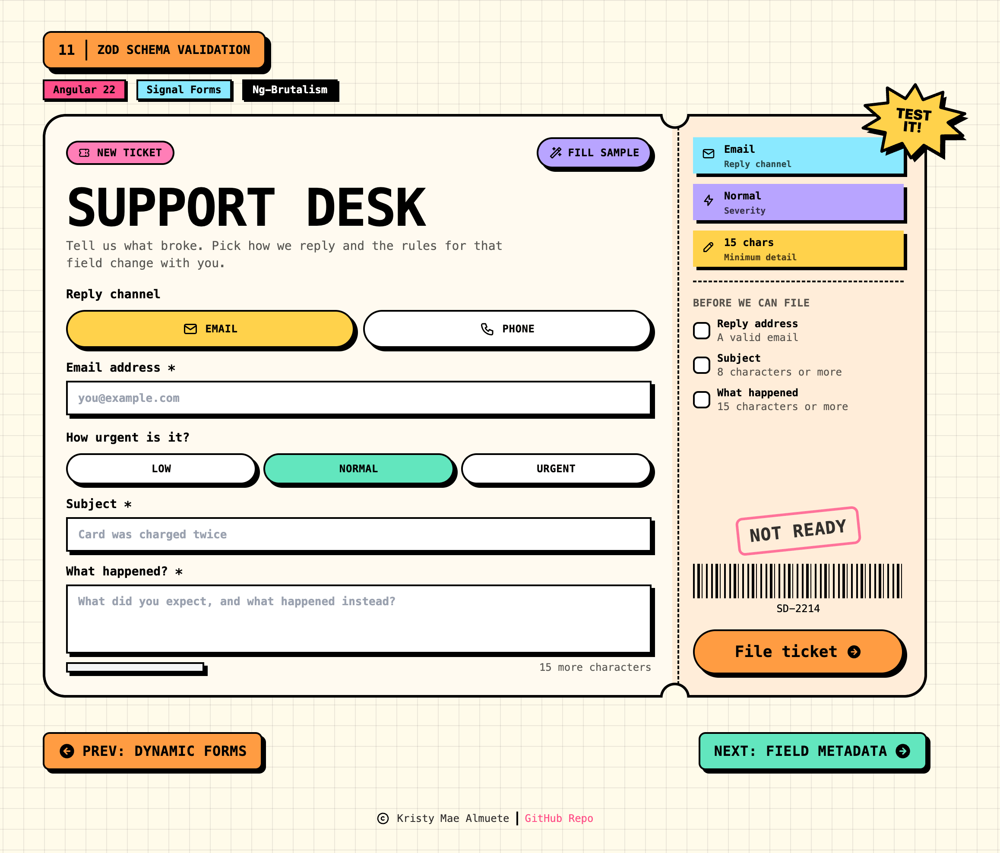

# 11 · Zod Schema Validation

> The **schema validation** recipe: a neo-brutalist **Support Desk** ticket where the rules
> move but the fields do not. **`validateStandardSchema`** hands validation to a **Zod v4**
> schema, and because it accepts a `LogicFn` the schema itself is reactive: the reply
> channel swaps the rule on `contact`, and the severity swaps the minimum on the
> description. Each call binds to the one field it validates. No
> `ReactiveFormsModule`, no `FormBuilder`.

<p align="center">
  
</p>

<p align="center">
  <a href="https://kshewengger.github.io/angular-signal-forms-cookbook/11-zod-schema/"><strong>▶ Live Demo</strong></a>
</p>

<p align="center">Part of the <a href="../../README.md">Angular Signal Forms Cookbook</a>.</p>

---

## How to run

Run every command from the **repository root**. This is an Nx integrated monorepo, so
all projects share a single root `package.json`.

| Task                              | Command                            |
| --------------------------------- | ---------------------------------- |
| **Serve** (http://localhost:4211) | `pnpm serve:11-zod-schema`         |
| Serve (direct)                    | `pnpm exec nx serve 11-zod-schema` |
| Build                             | `pnpm exec nx build 11-zod-schema` |
| Test                              | `pnpm exec nx test 11-zod-schema`  |

---

## Signal Forms API at a glance

| API                                        | What it does                                                               | Where in this recipe                           |
| ------------------------------------------ | -------------------------------------------------------------------------- | ---------------------------------------------- |
| `validateStandardSchema(path, schema)`     | Validates a field or a subtree with any Standard Schema library            | `ticketSchema`, three times                    |
| `validateStandardSchema(path, (ctx) => …)` | The `LogicFn` overload: pick the schema **at validation time**             | both calls, so the schema is reactive          |
| `ctx.valueOf(path)`                        | Reads a sibling field from inside the logic function                       | `valueOf(path.channel)` picks the contact rule |
| `ctx.valueOf(path)` (again)                | Every reactive rule here reads a sibling, never its own value              | `valueOf(path.severity)` picks the minimum     |
| `form(model, schema, { submission })`      | Configures the submission `action`, `onInvalid`, and `ignoreValidators`    | `ticketForm`                                   |
| `[formRoot]`                               | Wires a native `<form>` to submit (sets `novalidate`, prevents default)    | the ticket `<form [formRoot]="ticketForm">`    |
| `field().submitting()`                     | `true` while the async action runs; drives the spinner                     | the File ticket button                         |
| `onInvalid` + `focusBoundControl()`        | Runs when client validation blocks submit; focuses the first invalid field | submitting an empty ticket                     |
| `form().reset(value)`                      | Restores the model and interaction state to a pristine snapshot            | switching reply channel, and Retry             |
| `FormField` / `[formField]`                | Binds a native control to a field                                          | contact, subject, detail                       |

---

## The form

One flat `Ticket`. Every field is always present; only the rules change.

| Field      | Control              | Type                            | Validation                                   |
| ---------- | -------------------- | ------------------------------- | -------------------------------------------- |
| `channel`  | two toggle buttons   | `'email' \| 'phone'`            | discriminant; not a typed input              |
| `contact`  | `nbInput` text       | `string`                        | `z.email()` or `z.string().regex(E164)`      |
| `severity` | three toggle buttons | `'low' \| 'normal' \| 'urgent'` | discriminant; not a typed input              |
| `subject`  | `nbInput` text       | `string`                        | `z.string().min(8)`                          |
| `detail`   | `nbTextarea`         | `string`                        | `z.string().min(10 \| 15 \| 20)` by severity |

```ts
export type Ticket = {
  channel: ReplyChannel;
  contact: string;
  severity: Severity;
  subject: string;
  detail: string;
};
```

---

## A reactive Zod schema (the recipe's core idea)

The second argument to `validateStandardSchema` is either a schema **or a function that
returns one**. Taking the function form is what makes the schema reactive: it re-runs as
the signals it reads change, so a different Zod object validates the field.

```ts
const E164_PATTERN = /^\+[1-9]\d{7,14}$/;

export const subjectSchema = z.string().min(SUBJECT_MIN_LENGTH, `Give the ticket a subject of at least ${SUBJECT_MIN_LENGTH} characters.`);

export function contactSchema(channel: ReplyChannel): z.ZodType<string> {
  return channel === 'email' ? z.email('We need a valid email to reply.') : z.string().regex(E164_PATTERN, 'Use international format, e.g. +639171234567.');
}

export function detailSchema(severity: Severity): z.ZodType<string> {
  const minimum = DETAIL_MIN_LENGTH[severity];

  return z.string().min(minimum, `Tell us at least ${minimum} characters so we can route this.`);
}

export function ticketSchema(path: SchemaPathTree<Ticket>): void {
  validateStandardSchema(path.contact, ({ valueOf }) => contactSchema(valueOf(path.channel)));

  validateStandardSchema(path.subject, subjectSchema);

  validateStandardSchema(path.detail, ({ valueOf }) => detailSchema(valueOf(path.severity)));
}
```

| Call                                | Reads      | Effect when it flips                               |
| ----------------------------------- | ---------- | -------------------------------------------------- |
| `validateStandardSchema(p.contact)` | `channel`  | email format becomes E.164 format, message and all |
| `validateStandardSchema(p.subject)` | nothing    | static rule, so it takes the schema object itself  |
| `validateStandardSchema(p.detail)`  | `severity` | the minimum moves to 10, 15, or 20                 |

Three details worth reading twice:

- **Every call binds to the field it validates.** An earlier draft handed one
  `z.object({ subject, detail })` to the root and parameterised it by severity, but only
  `detail` depends on severity. Subject was riding along in a function that took an argument
  it never used. Splitting them makes each rule's real dependency visible in its signature.
- **Both overloads are here.** `subject` passes the schema **object**, because its rule never
  changes. `contact` and `detail` pass a **function**, which is what makes those two reactive.
  If a rule does not vary, do not wrap it in a `LogicFn`.
- **A schema bound higher up routes its issues by path.** Handing a `z.object` to a group or
  to the root is legal, and Angular puts each issue on the field its path names. A partial
  schema type-checks too, since the signature is
  `TModel extends IgnoreUnknownProperties<TSchema>`. This recipe does not need it, because
  no rule here spans more than one field, but it is the tool for a Zod schema shared with a
  server contract.

### How this differs from recipe 10

Both recipes branch, at different layers. Recipe 10 uses `applyWhenValue` to change the
form's **shape**: fields appear and disappear with the role. Recipe 11 keeps every field
mounted and changes only the **rules**. Reach for `applyWhenValue` when the model itself
has variants, and for a reactive Zod schema when the shape is fixed and a library already
owns the constraints.

### What handing validation to Zod costs

| Written as                          | Error `kind`        | `state.required()` | `state.minLength()` |
| ----------------------------------- | ------------------- | ------------------ | ------------------- |
| `required()` + `minLength(path, 8)` | `'required'`        | `true`             | `8`                 |
| `validate(path, fn)`                | whatever you return | `false`            | `undefined`         |
| `validateStandardSchema(path, …)`   | `'standardSchema'`  | `false`            | `undefined`         |

Only the built-in validators publish metadata, so a Zod-validated field cannot drive a
required asterisk or a character counter from field state. This recipe reads
`DETAIL_MIN_LENGTH` from `app.data.ts` for the counter and the checklist instead.

Every Zod issue also arrives under the same `kind`, so `ValidationErrors` tracks its list
by `$index` rather than by `error.kind`. Tracking by kind would produce duplicate keys the
moment one field carried two issues.

---

## The stub

The tear-off stub is not decoration: it is a readout of the schema currently in force.

| Row or element     | Reads                                      | Changes when                 |
| ------------------ | ------------------------------------------ | ---------------------------- |
| Reply channel      | `activeChannel()`                          | a channel button is pressed  |
| Severity           | `activeSeverity()`                         | a severity button is pressed |
| Minimum detail     | `detailMinLength()`                        | the severity changes         |
| Before we can file | `checks()`, one row per rule               | any field becomes valid      |
| The stamp          | `readyToFile()`, which is `form().valid()` | the last failing rule passes |

---

## Error display

Shared **`ValidationErrors`** reads `errors()` and gates on
`(dirty() || touched()) && invalid()`. The alert list carries `messageId` so
`aria-describedby` on the input points at the list itself, not the component host.

| Message                                                | Level       | Shows when                                   |
| ------------------------------------------------------ | ----------- | -------------------------------------------- |
| "We need a valid email to reply."                      | field (zod) | channel is email and contact is not an email |
| "Use international format, e.g. +639171234567."        | field (zod) | channel is phone and contact is not E.164    |
| "Give the ticket a subject of at least 8 characters."  | field (zod) | subject is shorter than 8                    |
| "Tell us at least 10 characters so we can route this." | field (zod) | severity is low and detail is short          |
| "Tell us at least 15 characters so we can route this." | field (zod) | severity is normal and detail is short       |
| "Tell us at least 20 characters so we can route this." | field (zod) | severity is urgent and detail is short       |

| When visible  | `(dirty \|\| touched) && invalid`                          |
| ------------- | ---------------------------------------------------------- |
| One error     | flat list, no bullets                                      |
| Many errors   | disc bullets (`list-disc`)                                 |
| Accessibility | `role="alert"` + `aria-live="polite"` + `id` = `messageId` |

---

## Form state

| State      | Signal                      | True when                                            |
| ---------- | --------------------------- | ---------------------------------------------------- |
| Submitting | `ticketForm().submitting()` | the mock send is in flight                           |
| Filed      | `filed()`                   | the action resolved true; cleared on Retry           |
| Invalid    | `field().invalid()`         | the currently active zod schema rejects the value    |
| Touched    | `field().touched()`         | focused and left, or submit ran                      |
| Dirty      | `field().dirty()`           | value differs from the last reset snapshot           |
| Valid      | `ticketForm().valid()`      | every active rule passes; drives the readiness stamp |

---

## Tech & tools

| Layer     | Tool                                                                       | Purpose                                                          |
| --------- | -------------------------------------------------------------------------- | ---------------------------------------------------------------- |
| Framework | **Angular 22** (standalone, signals, new control flow `@if`/`@for`/`@let`) | Application shell and reactivity                                 |
| Forms     | **`@angular/forms/signals`**                                               | `validateStandardSchema`, `[formRoot]`, `submitting()`           |
| Schema    | **Zod v4**                                                                 | Every validation rule, including the messages                    |
| UI kit    | **ng-brutalism** (`@ng-brutalism/ui`)                                      | `nbSplit`, `nb-media-item`, `nb-progress`, `nbInput`, `nbButton` |
| Icons     | **`@ng-icons/tabler-icons`**                                               | Channel icons, stub icons, lesson-nav arrows, footer copyright   |
| Styling   | **Tailwind CSS v4** (with the ng-brutalism theme) plus `app.scss`          | Utilities, plus the punched ticket notches                       |
| Images    | **`public/preview-app.png`**                                               | The README preview                                               |
| i18n      | **`@angular/localize`**                                                    | Translatable user-facing strings                                 |
| Tooling   | **Nx 23** + **esbuild**                                                    | Build, serve, and dependency graph                               |
| Tests     | **Vitest 4**                                                               | Isolated schema + component + `ValidationErrors` tests           |

---

## How it works

**1. Model the ticket as one flat shape** (`app.model.ts`)

```ts
export const INITIAL_TICKET: Ticket = {
  channel: 'email',
  contact: '',
  severity: 'normal',
  subject: '',
  detail: '',
};
```

**2. Keep the bounds as data** (`app.data.ts`)

```ts
export const SUBJECT_MIN_LENGTH = 8;

export const DETAIL_MIN_LENGTH: Record<Severity, number> = {
  low: 10,
  normal: 15,
  urgent: 20,
};
```

The UI needs these numbers for the counter and the checklist, and a Zod rule publishes no
metadata to read them back from, so they live in `app.data.ts` and both sides import them.

**3. Let the schema read its own form** (`app.schema.ts`)

```ts
validateStandardSchema(path.contact, ({ valueOf }) => contactSchema(valueOf(path.channel)));
```

No component is involved. `ticketSchema` is a plain `SchemaFn`, so the isolated tests build
it with `form(model, ticketSchema)` and flip `channel` or `severity` directly.

**4. Build the form and configure submission** (`app.ts`)

```ts
protected readonly ticketForm = form(this.ticketModel, ticketSchema, {
  submission: {
    action: async () => {
      const sent = await this.sendTicket();

      this.filed.set(sent);
    },
    onInvalid: (field) =>
      field().errorSummary()[0]?.fieldTree().focusBoundControl(),
    ignoreValidators: 'none',
  },
});
```

**5. Split the ticket, and punch the notch** (`app.html`, `app.scss`)

```html
<form nbSplit novalidate ratio="fill:auto" collapse="lg" separator="dashed" [formRoot]="ticketForm"></form>
```

`nbSplit` gives the two halves, the dashed perforation, and the stack below `lg`. The
notches are the one thing with no primitive, so `app.scss` masks the shell and the body
with matching circles, the body's one border-width wider so the black edge survives as an
arc.

---

## Testing

Following the [Signal Forms testing guide](https://angular.dev/guide/forms/signals/testing),
tests are split by concern:

- **Isolated schema tests** build the form directly from `ticketSchema`
  (`form(model, ticketSchema, { injector })`), with no component and no DOM, and assert
  both branches of the contact rule, all three severity minimums (parametrized from
  `DETAIL_MIN_LENGTH`), that flipping `channel` or `severity` swaps the active schema, and
  that every zod issue lands under the `standardSchema` kind.
- **Component tests** cover only what the rendered template shows: the controls render,
  touching contact surfaces the message, the phone channel swaps both label and rule,
  switching channel resets the ticket, escalating severity moves the minimum on the stub,
  the sample button fills a valid ticket, an empty submit is blocked by `onInvalid`, and a
  valid submit shows the filed stub which Retry clears.
- **`ValidationErrors`** is tested against the real fields, so its visibility gating, each
  recipe message, the single-error list, `role="alert"`, and `messageId` on the alert list
  are verified against the actual recipe.

---

## Internationalization

Every user-facing string is translatable. Template text uses `i18n="@@stableId"` and
TypeScript strings use the `$localize` tagged template. The `@angular/localize/init`
polyfill is wired in `project.json` (build) and `test-setup.ts` (tests). Keep the
`@@` IDs stable; they are the translation contract.
