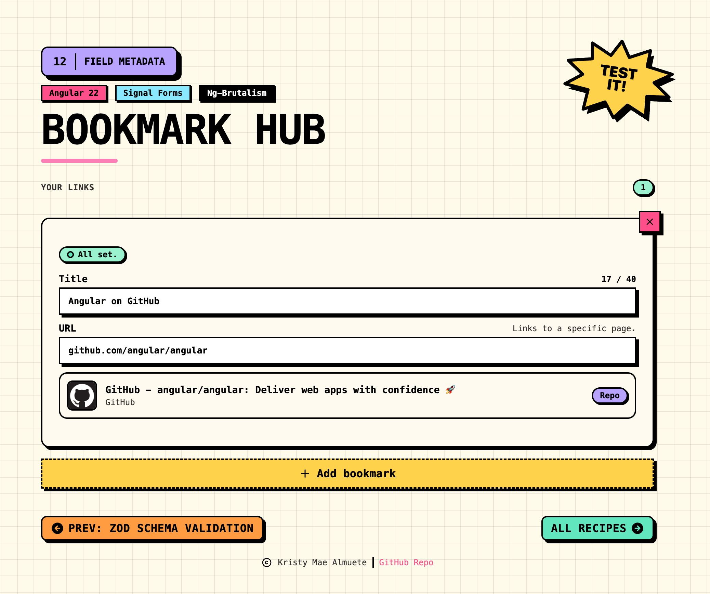

# 12 · Field Metadata

> The **field metadata** recipe: a neo-brutalist **Bookmark Hub** where every link carries
> reactive data beyond its value. A built-in `maxLength` drives a live character counter, a
> custom **`createMetadataKey`** tags the platform, a custom **`MetadataReducer`** merges a
> status, a built-in **`MetadataReducer.list()`** collects help hints, and a managed
> **`createManagedMetadataKey`** runs a live link preview (an `httpResource` against
> Microlink) once per url field. Every value is read back with `field().metadata(key)`. No
> `ReactiveFormsModule`, no `FormBuilder`.

<p align="center">
  
</p>

<p align="center">Part of the <a href="../../README.md">Angular Signal Forms Cookbook</a>.</p>

---

## How to run

Run every command from the **repository root**. This is an Nx integrated monorepo, so
all projects share a single root `package.json`.

| Task                              | Command                                |
| --------------------------------- | -------------------------------------- |
| **Serve** (http://localhost:4212) | `pnpm serve:12-field-metadata`         |
| Serve (direct)                    | `pnpm exec nx serve 12-field-metadata` |
| Build                             | `pnpm exec nx build 12-field-metadata` |
| Test                              | `pnpm exec nx test 12-field-metadata`  |

---

## Signal Forms API at a glance

| API                                   | What it does                                                                   | Where in this recipe                     |
| ------------------------------------- | ------------------------------------------------------------------------------ | ---------------------------------------- |
| `metadata(path, key, logic)`          | Registers a reactive value for a key on a field, re-runs as its signals change | six rules in `bookmarkItemSchema`        |
| `createMetadataKey<T>()`              | A custom key, last write wins (the default `override` reducer)                 | `PLATFORM` (the category badge)          |
| `createMetadataKey<T, TAcc>(reducer)` | A custom key whose contributions merge through a reducer                       | `STATUS` (custom severity reducer)       |
| `MetadataReducer.list<T>()`           | A built-in reducer that collects contributions into a `T[]`                    | `HELP` (the url guidance hints)          |
| `createManagedMetadataKey(create)`    | A lifecycle-bound value per field; `create` runs in the field's injector       | `URL_PREVIEW` (a resource per url field) |
| `httpResource(request, { parse })`    | A reactive HTTP request exposed as a resource, with a response mapper          | inside `URL_PREVIEW`, calls Microlink    |
| `maxLength(path, n)`                  | Validates **and** publishes `MAX_LENGTH` metadata                              | title counter reads the limit back       |
| `required(path)`                      | Validates **and** publishes `REQUIRED` metadata                                | the url field                            |
| `field().metadata(key)`               | Reads a key's current (reduced) value in the component                         | every `BookmarkCard` computed            |
| `FormField` / `[formField]`           | Binds a native control to a field                                              | the title and url inputs                 |

---

## The form

One tiny reusable model, applied to every bookmark in the collection.

| Field   | Control        | Type     | Validation      |
| ------- | -------------- | -------- | --------------- |
| `title` | `nbInput` text | `string` | `maxLength(40)` |
| `url`   | `nbInput` text | `string` | `required`      |

```ts
export type Bookmark = { id: string; title: string; url: string };

export type BookmarkCollection = { bookmarks: Bookmark[] };
```

The two validators do double duty: they gate the field **and** publish metadata
(`MAX_LENGTH`, `REQUIRED`) that the UI reads back. That is the recipe's first lesson,
constraint validators are the built-in metadata producers.

---

## Five kinds of metadata (the recipe's core idea)

Metadata is reactive data attached to a field and read with `field().metadata(key)`. It is
distinct from validation: validators surface errors, metadata publishes values. This recipe
attaches all five flavours the guide covers, defined in `app.metadata.ts`:

```ts
// 1. custom key, default override reducer (last write wins)
export const PLATFORM = createMetadataKey<Platform | undefined>();

// 2. custom key with a CUSTOM reducer (keep the highest severity)
const severityReducer: MetadataReducer<StatusHint, StatusHint> = {
  getInitial: () => STATUS_HINTS.ready,
  reduce: (acc, item) => (SEVERITY_RANK[item.level] > SEVERITY_RANK[acc.level] ? item : acc),
};
export const STATUS = createMetadataKey<StatusHint, StatusHint>(severityReducer);

// 3. custom key with a BUILT-IN reducer (collect contributions into an array)
export const HELP = createMetadataKey(MetadataReducer.list<string>());

// 4. managed key: a lifecycle-bound resource, one per field
export const URL_PREVIEW = createManagedMetadataKey((_state, url: Signal<string | undefined>) =>
  httpResource<LinkPreview>(
    () => {
      const value = (url() ?? '').trim();
      const domain = domainOf(value);
      return domain ? { url: 'https://api.microlink.io/', params: { url: withProtocol(value) } } : undefined;
    },
    { parse: (raw) => toLinkPreview(raw as MicrolinkResponse) },
  ),
);
```

| Key           | Reducer                             | Reads as                       | Drives                          |
| ------------- | ----------------------------------- | ------------------------------ | ------------------------------- |
| `MAX_LENGTH`  | built-in (published by `maxLength`) | `Signal<number>`               | the title `12 / 40` counter     |
| `PLATFORM`    | `override` (default)                | `Signal<Platform>`             | the category badge (Repo, Docs) |
| `STATUS`      | **custom** (keep-highest)           | `Signal<StatusHint>`           | the status pill (one action)    |
| `HELP`        | **built-in `list()`**               | `Signal<string[]>`             | the url guidance hints          |
| `URL_PREVIEW` | managed                             | `HttpResourceRef<LinkPreview>` | the live link preview           |

Two of these are reducers, on purpose:

- **`STATUS` (custom reducer)** merges two `metadata()` contributions (url empty, title
  empty) and keeps the **highest severity**, so the pill shows the single most urgent
  action.
- **`HELP` (built-in `list()`)** collects every applicable contribution into an array, so
  the guidance lines aggregate. Both hints are fully derived from the field (homepage vs
  specific page, recognized vs unknown site), which is the whole point of routing them
  through metadata instead of hardcoding text: the set recomputes as you type.

---

## The link preview (managed metadata)

`URL_PREVIEW` is the marquee facet. `createManagedMetadataKey`'s `create` function runs
**once per url field**, in that field's injection context, and returns an `httpResource`
that fetches a preview from the [Microlink](https://microlink.io) unfurl API. Because the
resource is tied to the field, it re-fetches as the url changes (debounced) and is disposed
when the row is removed.

```ts
metadata(item.url, URL_PREVIEW, ({ value }) => value()); // feed the url into the managed key
```

The raw Microlink response is mapped by a pure `toLinkPreview()` helper (in `app.utils.ts`),
so the mapping is unit-testable without any HTTP harness, and swapping Microlink for another
provider is a one-line change. An invalid url short-circuits to idle (no request); a
reachable-but-failed lookup surfaces the resource's `error()` state.

| Resource state         | Card shows                         |
| ---------------------- | ---------------------------------- |
| `isLoading()`          | a spinner and "Fetching preview…"  |
| `error()`              | "Could not reach that site."       |
| `value()`              | the logo, title, domain, and badge |
| idle (empty / invalid) | "Link preview appears here."       |

---

## Error display

Both messages surface through the shared **`ValidationErrors`** component bound to the
title and url fields, which reads `errorSummary()` and gates visibility on
`(dirty() || touched()) && invalid()`.

| Message                            | Level             | Shows when                    |
| ---------------------------------- | ----------------- | ----------------------------- |
| "Add a link before saving."        | field (required)  | a touched url is empty        |
| "Titles stay under 40 characters." | field (maxLength) | a title exceeds 40 characters |

| When visible  | `(dirty \|\| touched) && invalid`     |
| ------------- | ------------------------------------- |
| One error     | flat list, no bullets                 |
| Many errors   | disc bullets (`list-disc`)            |
| Accessibility | `role="alert"` + `aria-live="polite"` |

---

## Form state

| State   | Signal                                      | True when                            |
| ------- | ------------------------------------------- | ------------------------------------ |
| Count   | `bookmarks().length`                        | number of bookmark rows              |
| Invalid | `bookmarkForm.bookmarks[i].url().invalid()` | a row's url is empty                 |
| Touched | `field().touched()`                         | focused and left                     |
| Dirty   | `field().dirty()`                           | value differs from the seed snapshot |

---

## Tech & tools

| Layer     | Tool                                                                       | Purpose                                                                                      |
| --------- | -------------------------------------------------------------------------- | -------------------------------------------------------------------------------------------- |
| Framework | **Angular 22** (standalone, signals, new control flow `@if`/`@for`/`@let`) | Application shell and reactivity                                                             |
| Forms     | **`@angular/forms/signals`**                                               | `metadata`, `createMetadataKey`, `createManagedMetadataKey`, `MetadataReducer`               |
| HTTP      | **`@angular/common/http`**                                                 | `httpResource` inside the managed key, `provideHttpClient`                                   |
| Preview   | **[Microlink](https://microlink.io)**                                      | The live link-unfurl endpoint (mocked in tests)                                              |
| UI kit    | **ng-brutalism** (`@ng-brutalism/ui`)                                      | `nb-card`, `nbInput`, `nbBadge`, `nbStatusDot`, `nbIconButton`, `nbLabel`                    |
| Icons     | **`@ng-icons/tabler-icons`**                                               | Remove, add, lesson-nav arrows, footer copyright                                             |
| Styling   | **Tailwind CSS v4** (with the ng-brutalism theme) plus `app.css`           | Utilities, plus the spinner and the card enter animation                                     |
| Images    | **`public/preview-app.png`**                                               | The README preview                                                                           |
| i18n      | **`@angular/localize`**                                                    | Translatable user-facing strings                                                             |
| Tooling   | **Nx 23** + **esbuild**                                                    | Build, serve, and dependency graph                                                           |
| Tests     | **Vitest 4**                                                               | Isolated schema/metadata + `toLinkPreview` + component + `BookmarkCard` + `ValidationErrors` |

---

## How it works

**1. Seed the collection** (`app.data.ts`)

```ts
export const INITIAL_COLLECTION: BookmarkCollection = {
  bookmarks: [{ id: 'seed-1', title: 'Angular on GitHub', url: 'github.com/angular/angular' }],
};
```

**2. Keep the registries as data** (`app.data.ts`)

The platform categories, tones, dot states, status hints, and `TITLE_MAX_LENGTH` live in
`app.data.ts`; the schema and the card import them.

**3. Define the metadata keys** (`app.metadata.ts`)

The five keys and the custom `severityReducer` live here, next to each other, so the schema
imports them by name.

**4. Register the metadata in the schema** (`app.schema.ts`)

```ts
export const bookmarkItemSchema = schema<Bookmark>((item) => {
  required(item.url, { message: $localize`:@@urlRequired:Add a link before saving.` });
  maxLength(item.title, TITLE_MAX_LENGTH, { message: $localize`:@@titleTooLong:Titles stay under ${TITLE_MAX_LENGTH}:max: characters.` });
  debounce(item.url, 500);

  metadata(item.url, PLATFORM, ({ value }) => {
    const d = domainOf(value());
    return d ? platformOf(d) : undefined;
  });
  metadata(item.url, URL_PREVIEW, ({ value }) => value());
  metadata(item, STATUS, ({ valueOf }) => (valueOf(item.url).trim() ? STATUS_HINTS.ready : STATUS_HINTS.needsLink));
  metadata(item, STATUS, ({ valueOf }) => (valueOf(item.title).trim() ? STATUS_HINTS.ready : STATUS_HINTS.needsTitle));
  // two more HELP rules feed the list() reducer
});

export function bookmarkHubSchema(path: SchemaPathTree<BookmarkCollection>): void {
  applyEach(path.bookmarks, bookmarkItemSchema);
}
```

`bookmarkHubSchema` is a plain `SchemaFn`, and `bookmarkItemSchema` is a reusable
`schema<Bookmark>` object because `applyEach` runs it on every array element. The isolated
tests build `form(model, bookmarkHubSchema)` directly.

**5. Read the metadata in a child component** (`bookmark-card.ts`)

Each row is a `BookmarkCard` that takes the item `FieldTree` as an input and reads every key
through named computeds. This is the field-subtree container pattern (like recipe 10), not a
custom control (recipe 06).

```ts
readonly field = input.required<FieldTree<Bookmark>>();

protected readonly urlState = computed(() => this.field().url());
protected readonly platform = computed(() => this.urlState().metadata(PLATFORM)?.());
protected readonly status = computed(() => this.field()().metadata(STATUS)?.());
protected readonly help = computed(() => this.urlState().metadata(HELP)?.() ?? []);
protected readonly preview = computed(() => this.urlState().metadata(URL_PREVIEW));
```

**6. Render it** (`bookmark-card.html`)

The `FieldTree` is bound to `[formField]` inline (`field().title`), while the derived
computeds drive the counter, badge, pill, hints, and preview.

---

## Testing

Following the [Signal Forms testing guide](https://angular.dev/guide/forms/signals/testing),
tests are split by concern:

- **Isolated schema/metadata tests** build the form directly from `bookmarkHubSchema`
  (`form(model, bookmarkHubSchema, { injector })`), with no component and no DOM, and assert
  the `required` and `maxLength` rules, the `MAX_LENGTH` limit, the `PLATFORM` classification
  (known, unknown, empty), and the `STATUS` reducer keeping the highest severity.
- **`toLinkPreview`** is unit-tested as a pure function: it maps a Microlink response and
  throws on a non-success status.
- **Component tests** cover only what the rendered templates show, using an inline HTTP
  interceptor that answers Microlink synchronously: the seed renders, the managed preview
  resolves into the card, the `list()` help hints aggregate, adding and removing rows works,
  and removing the last row shows the empty state.
- **`ValidationErrors`** is tested against the real fields, so its visibility gating, the
  required message, and `role="alert"` / `aria-live="polite"` are verified against the
  actual recipe.

---

## Internationalization

Every user-facing string is translatable. Template text uses `i18n="@@stableId"` and
TypeScript strings use the `$localize` tagged template. The `@angular/localize/init`
polyfill is wired in `project.json` (build) and `test-setup.ts` (tests). Keep the
`@@` IDs stable; they are the translation contract.
